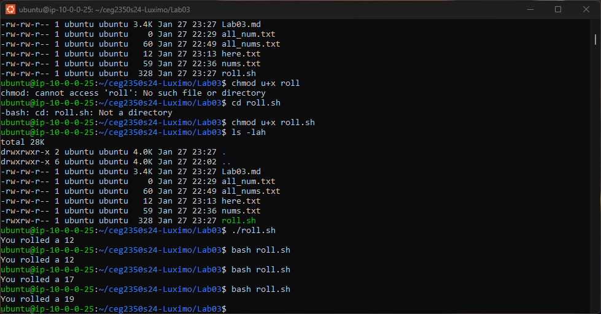
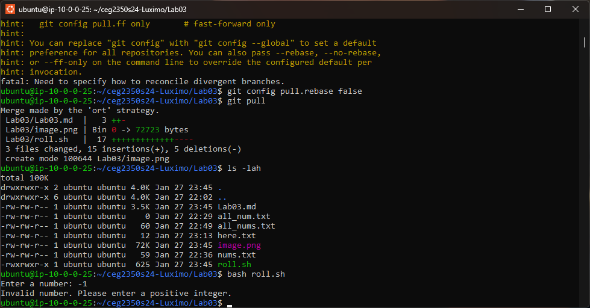
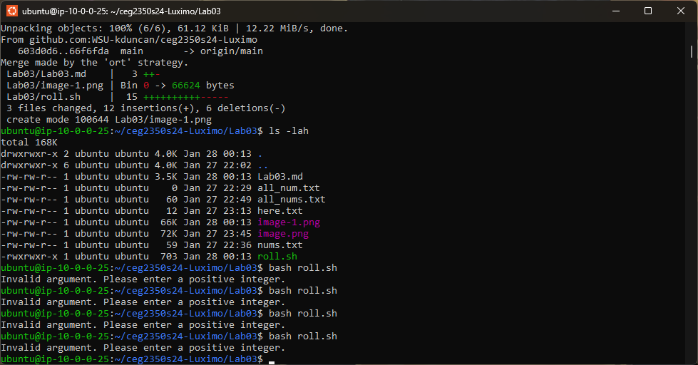
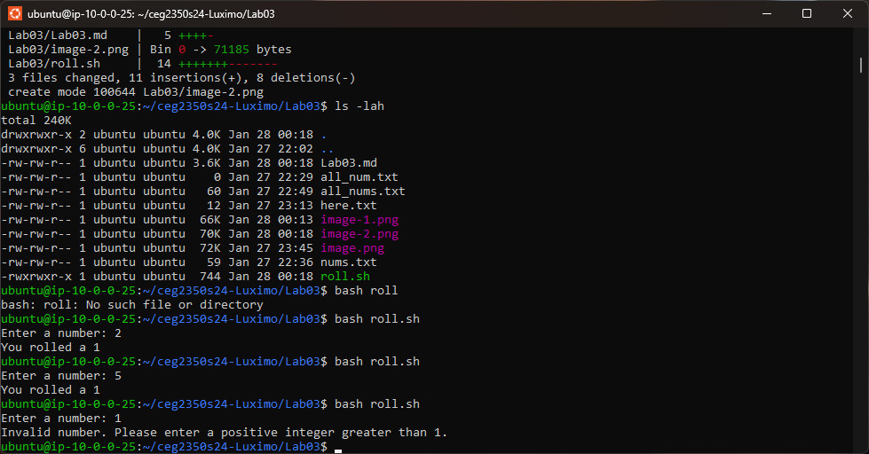
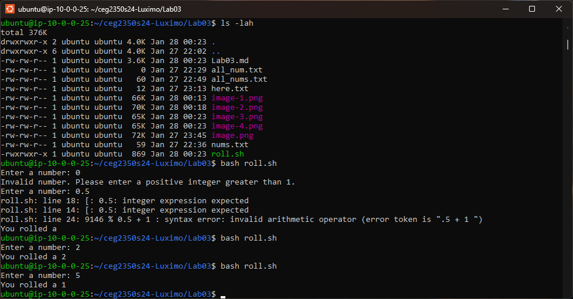
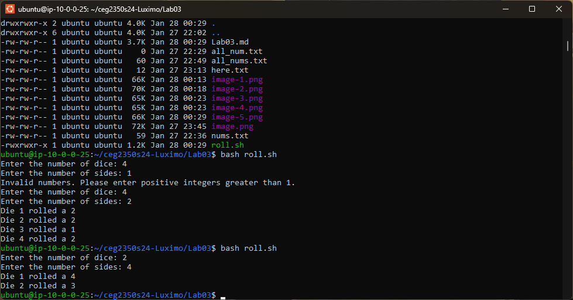
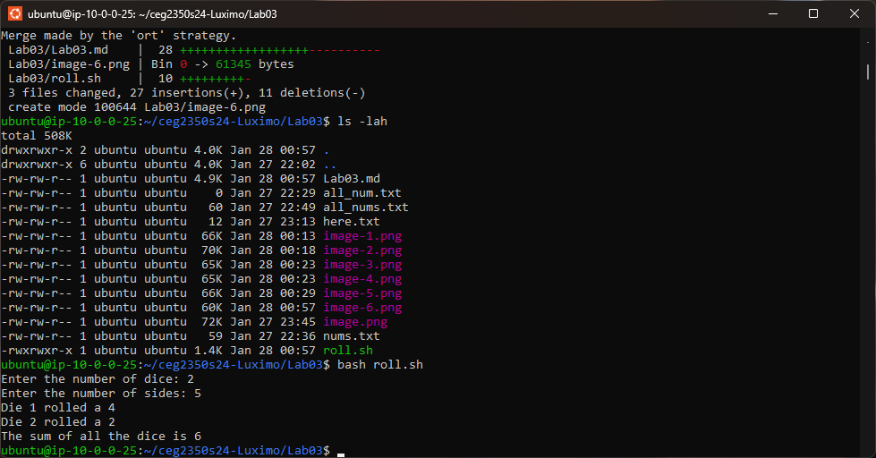

## Lab 03

- Name: Moses Otuvedo
- Email: otuvedo.3@wright.edu

## Part 1 Answers

1. `printenv $HOME > thishouse`: This command outputs the value of the environmental variable $HOME, which denotes the location of the user’s home directory, to the standard output stream, which is then redirected to a file with the name thishouse that resides in the current working directory. The file thishouse subsequently holds the location of the user’s home directory.

2. `cat doesnotexist 2>> hush.txt`: This command attempts to join the file with the name doesnotexist to the standard output stream, but due to the nonexistence of the file, it generates an error message to the standard error stream. The 2>> operator adds the standard error to the end of the file with the name hush.txt that is located in the current working directory. The file hush.txt subsequently contains the error message as the last part of its content.

3. `cat nums.txt | sort >> all_nums.txt`: This command joins the file with the name nums.txt to the standard output stream, which is then transferred to the sort command. The sort command arranges the lines of its input in ascending order based on the -n flag, which signifies numerical order. The arranged output is subsequently added to the end of the file with the name all_nums.txt that resides in the current working directory. The file all_nums.txt consequently contains the ordered numbers from nums.txt as the last part of its content.

4. `cat << "DONE" > here.txt`: This command generates a file with the name here.txt that resides in the current working directory and transfers the input from the standard input stream to the file until it meets the word DONE. The << operator is known as a here document and it enables the user to input multiple lines of input without using quotation marks or escape characters. For instance, if the user types:

 - `cat << "DONE" > here.txt ` in ubuntu...
 - `hello`
 - `world`
 - `DONE` (the program ends here)

5. `ls -lt ~ | head`: This command displays the files and directories that reside in the user’s home directory (~) to the standard output stream, in accordance with the -l flag, which signifies long format, and the -t flag, which signifies sorted by modification time in descending order. The output is subsequently transferred to the head command, which outputs the first 10 lines of its input to the standard output stream. The outcome is the 10 most recently altered files or directories that reside in the user’s home directory, along with their attributes such as permissions, owner, size, and date.

6. `history | grep ".md"`: This command outputs the history of commands inputted by the user to the standard output stream, which is then transferred to the grep command. The grep command looks for lines that correspond to the pattern “.md”, which signifies any line that has the .md extension, and outputs them to the standard output stream. The outcome is the list of commands that implicated files with the .md extension, such as markdown files.

## Part 2

Verify that `roll` made it to your GitHub repository for this course and is in your `Lab03` folder.  No answers will be written here unless you would like to leave a note to the TAs

## Part 3 - Retrospective Answers

1. 
Step 1 completed

2. 
Step 2 completed

3. 
Step 3 completed

4. 
Step 4 completed

5. 
Step 5 completed

6. 
Step 6 completed

7. Retrospective Answers
- Sometimes, composing scripts can be arduous and vexing, particularly when confronting syntax errors, logic errors, or unforeseen outcomes.🥲 It is imperative that I'd to examine my scripts frequently and utilize debugging tools or techniques to pinpoint and rectify the errors.😤 Learning scripts was fun though. 😎

## Part 5 Answers

1. PATH = `/usr/local/sbin:/usr/local/bin:/usr/sbin:/usr/bin:/sbin:/bin:/usr/games:/usr/local`
2. Create a directory named `bin` in your home directory. You can use the `mkdir` command to create a directory. For instance, you can type `mkdir ~/bin` in your terminal. Overall result is this: `/home/user/bin:/usr/local/sbin:/usr/local/bin:/usr/sbin:/usr/bin:/sbin:/bin:/usr/local/games:/usr/games`

3. Command: `mkdir ~/bin`
   - Full path: `/home/ubuntu/bin`

4. PATH = `/home/ubuntu/bin:/usr/local/sbin:/usr/local/bin:/usr/sbin:/usr/bin:/sbin:/bin:/usr`
   - Difference: `/home/ubuntu/bin` is added to the beginning of the `PATH` environment variable...🤔

5. `cp roll.sh ~/bin`

6. I use this command at first `chmod u+x roll.sh` to run the script and works fine and later switch to this command `chmod +x roll.sh` just now.

7. The entities of user, group, and other are all endowed with the execute permission. It is obvious though...😇

## Extra Credit

1. Note here *what* you did to the script for the extra credit.

Extra credit answer: 
- This is a script that outputs a random number for each die and the sum of all the dice.
- I already showed @aliAljaffer (Ali) and he approved the script for the extra credit.