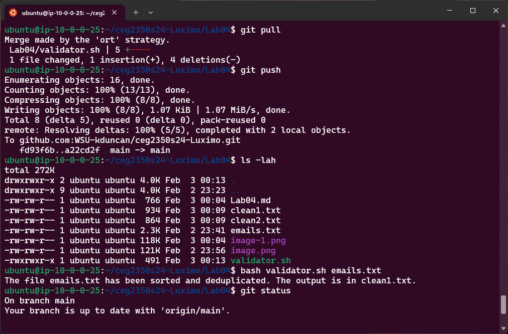
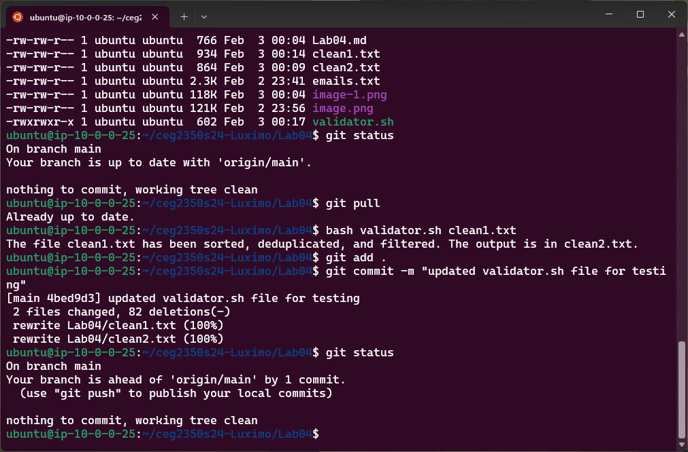

## Lab 04

- Name: Moses Otuvedo
- Email: Otuvedo.3@wright.edu

## Part 1 

Make sure the following files are in your GitHub repository
- validator (with commits for each step complete)

1. 
step one completed

2. 
step two completed

3. 

- `clean1.txt` through `clean4.txt`

## Part 2 Answers

1. `place your sed commands between backtick characters`
2. `so that they are pretty and readable in markdown`
3. `replace these examples with your commands`
4. `do this for rest of commands in lab`
5.
6. 

## Part 3 Answers

1.
2.
3.
4.
5.

## Extra Credit - Remove this if not doing

1. Source: 
    - Regular Expression Pattern: 
2. Pattern explanation:
3. Verify `validator2` is in your GitHub repository