## Lab 04

- Name: Moses Otuvedo
- Email: Otuvedo.3@wright.edu

## Part 1 

Make sure the following files are in your GitHub repository
- validator (with commits for each step complete)

1. 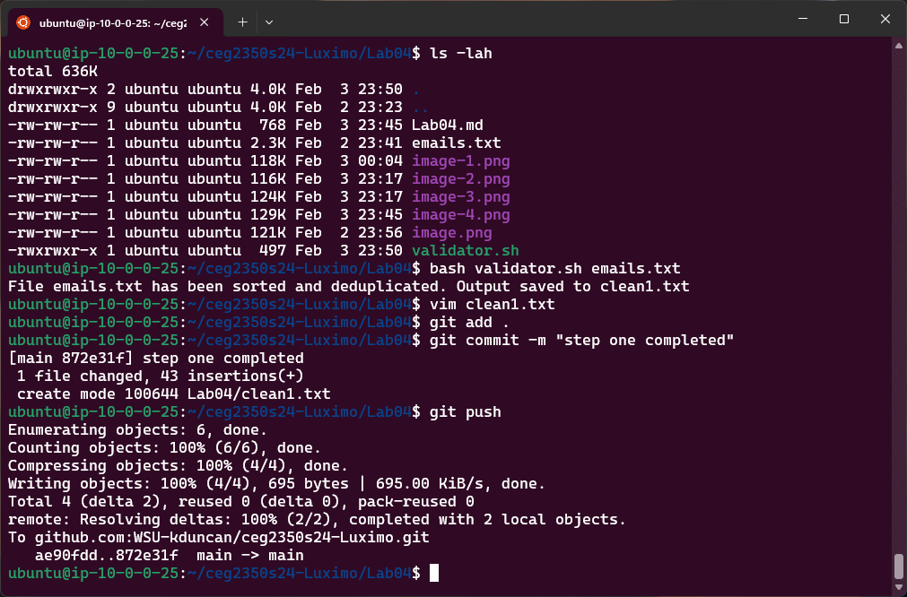
(step one completed)

2. 
(step two completed)

3. 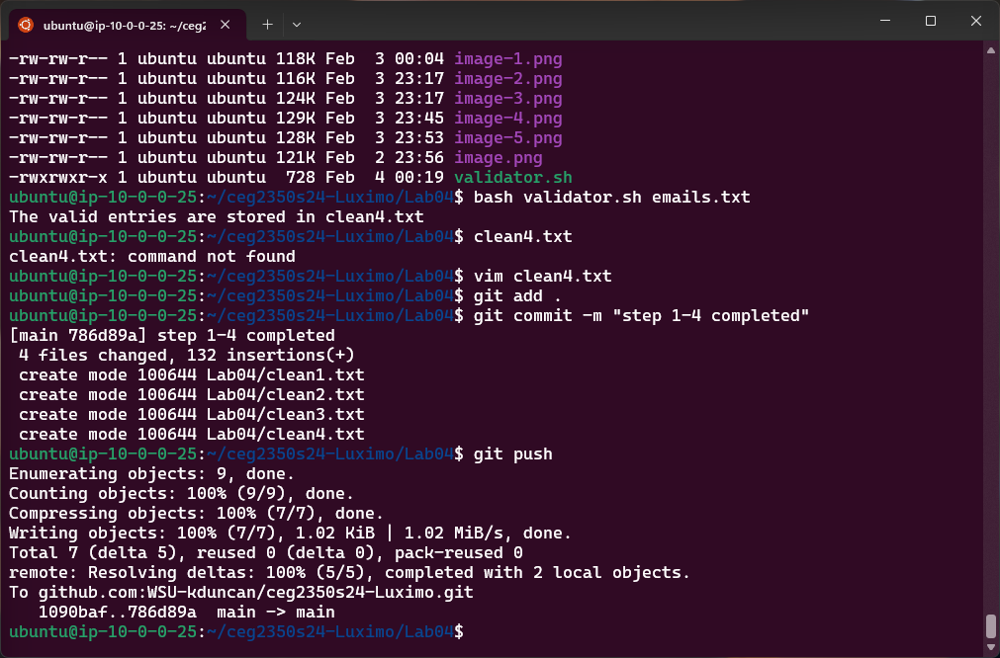
(step three completed)

4. 
(step four completed)

- `clean1.txt` through `clean4.txt`

- `clean1.txt file😎`
```
#_#@happy.face
#bringit@bomb.com
$$$bills@money.want
123john.doe@example.com
123user@example.com
9876user@example.net
?hello@gmail.com
admin@123.456
admin@website.com
alice smith@example.com 
alice.smith@example.com
alice_smith123@company.org
bob&jones@example.com 
bob..smith@example.net
bob_jones@example.com
charlie_brown@peanuts.com
chris.anderson@example..com 
chris.anderson@example.com
david.miller@ example.com 
david.miller@example.com
emily.white@example.com
emily@white@example.com 
invalid-email.com
invalid-email@.com
jennifer.brown@ example .com 
jennifer.brown@example.com
jenny.smith@123.co.uk
john.doe@example 
john.doe@example.com
johndoe@company
lisa.johnson@ 
lisa.johnson@example.com
mark.wilson@example,com 
mark.wilson@example.com
mike_tyson@boxing
sarah.connor@gmail.com
sarah.jackson@.com 
sarah.jackson@example.com
support@company
support@company.org
user123@example.co.uk
user@company..org
user@company.org
```


- `clean2.txt file😎`
```
123john.doe@example.com
123user@example.com
9876user@example.net
admin@123.456
admin@website.com
alice smith@example.com 
alice.smith@example.com
alice_smith123@company.org
bob&jones@example.com 
bob..smith@example.net
bob_jones@example.com
charlie_brown@peanuts.com
chris.anderson@example..com 
chris.anderson@example.com
david.miller@ example.com 
david.miller@example.com
emily.white@example.com
emily@white@example.com 
invalid-email.com
invalid-email@.com
jennifer.brown@ example .com 
jennifer.brown@example.com
jenny.smith@123.co.uk
john.doe@example 
john.doe@example.com
johndoe@company
lisa.johnson@ 
lisa.johnson@example.com
mark.wilson@example,com 
mark.wilson@example.com
mike_tyson@boxing
sarah.connor@gmail.com
sarah.jackson@.com 
sarah.jackson@example.com
support@company
support@company.org
user123@example.co.uk
user@company..org
user@company.org
```


- `clean3.txt file😎`
```
123john.doe@example.com
123user@example.com
9876user@example.net
admin@123.456
admin@website.com
alice smith@example.com 
alice.smith@example.com
alice_smith123@company.org
bob&jones@example.com 
bob_jones@example.com
charlie_brown@peanuts.com
chris.anderson@example.com
david.miller@example.com
emily.white@example.com
emily@white@example.com 
invalid-email.com
jennifer.brown@example.com
jenny.smith@123.co.uk
john.doe@example 
john.doe@example.com
johndoe@company
lisa.johnson@example.com
mark.wilson@example,com 
mark.wilson@example.com
mike_tyson@boxing
sarah.connor@gmail.com
sarah.jackson@example.com
support@company
support@company.org
user123@example.co.uk
user@company.org
```

- `clean4.txt file😎`
```
123john.doe@example.com
123user@example.com
9876user@example.net
admin@website.com
alice.smith@example.com
alice_smith123@company.org
bob_jones@example.com
charlie_brown@peanuts.com
chris.anderson@example.com
david.miller@example.com
emily.white@example.com
jennifer.brown@example.com
john.doe@example.com
lisa.johnson@example.com
mark.wilson@example.com
sarah.connor@gmail.com
sarah.jackson@example.com
support@company.org
user@company.org
```

## Part 2 Answers

1. `sed -e 's/<[/][^>]*>//g' sedfile.html > sedfile.md`
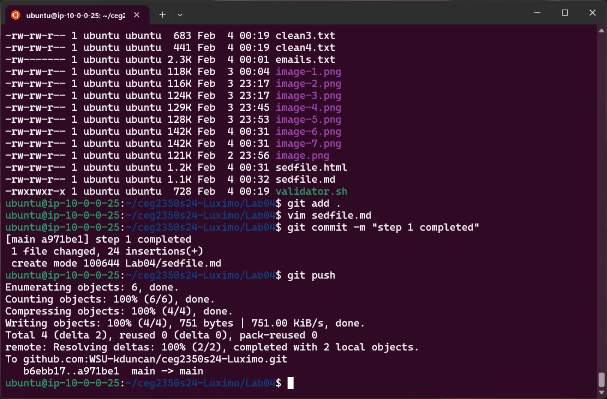

2. `sed -i -e 's/<li>/- /g' sedfile.md`
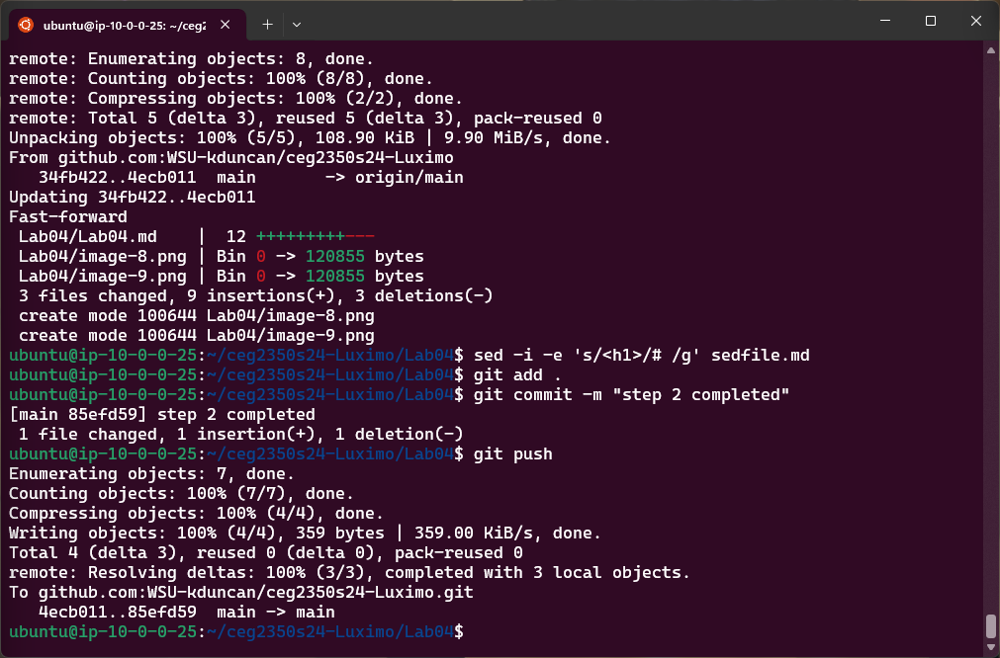

3. `sed -i -e 's/<h1>/# /g' sedfile.md`


4. `sed -i -e 's/<h2>/## /g' sedfile.md`
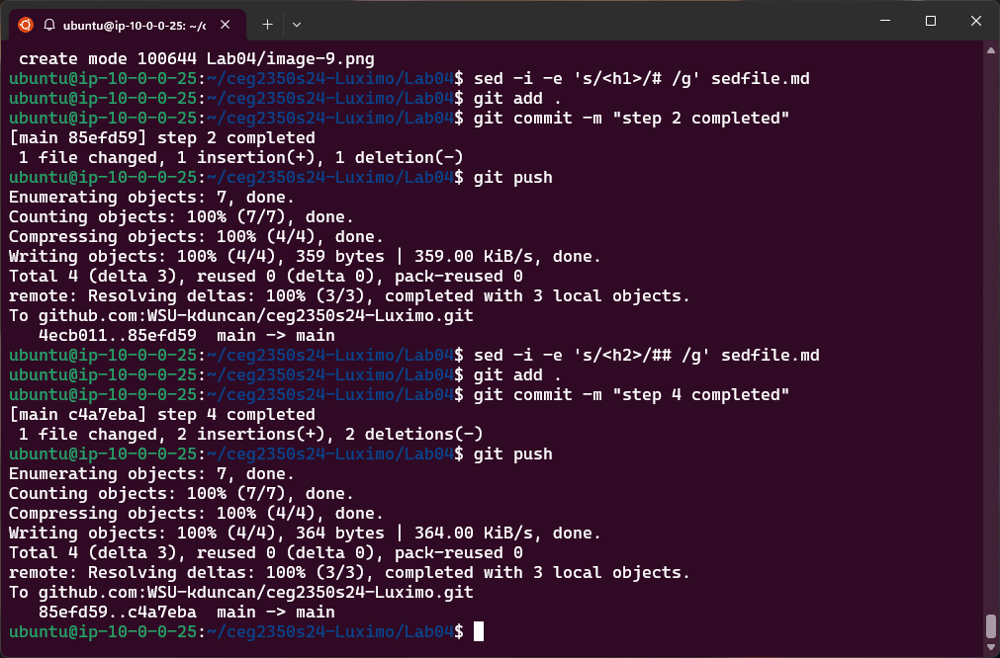

5. `sed -i -e '/<[^>]*>/d' sedfile.md`
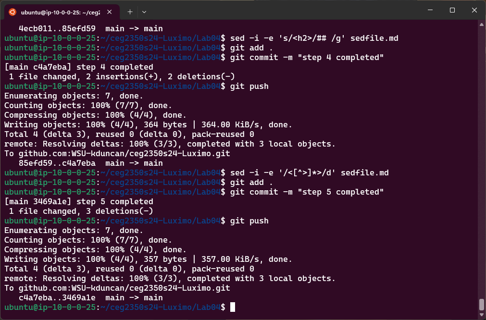

6. `sed -i -e 's/Batches/Matches/g' sedfile.md`
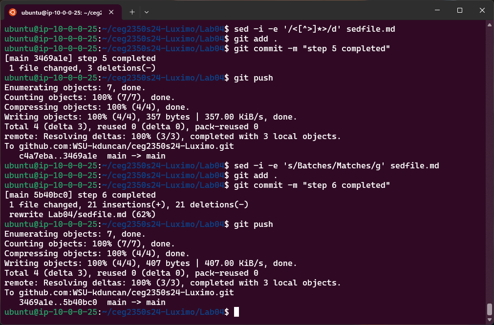

## Part 3 Answers

1. `awk '/Bil/ {print $1}' records.txt`
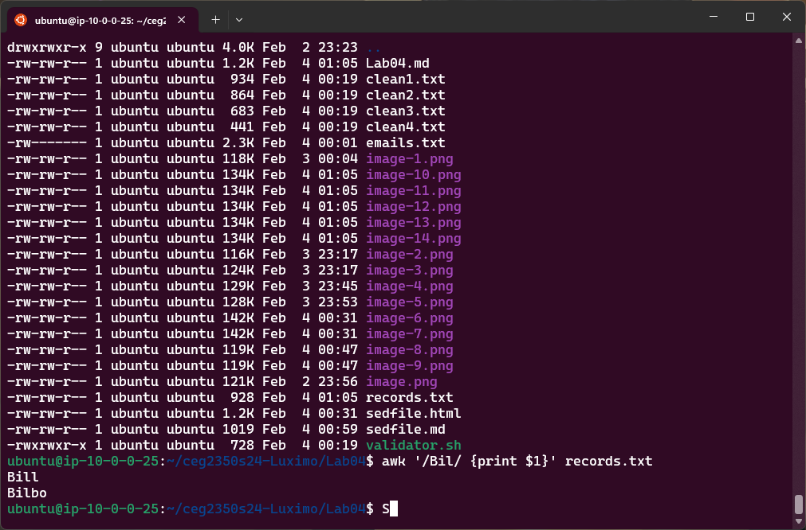

2. `awk '$4 ~ /42/ {print $3}' records.txt`
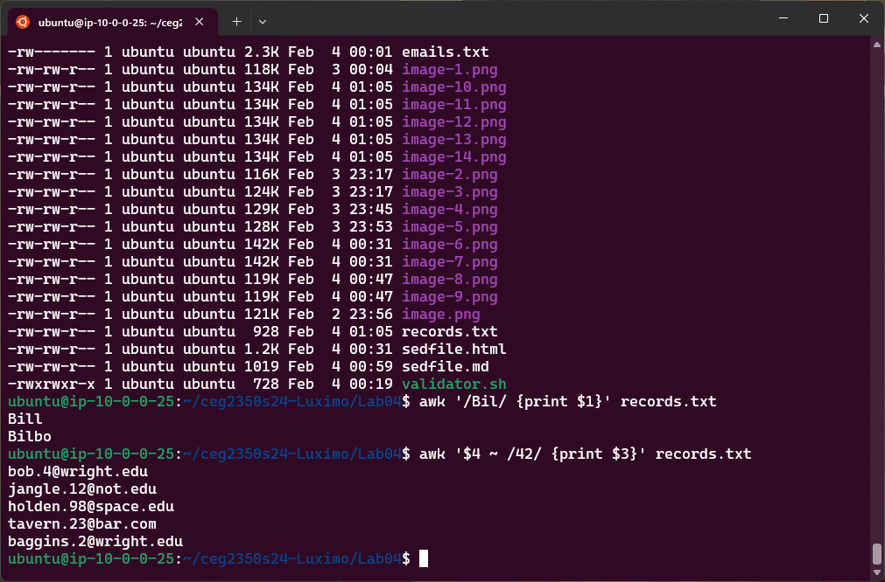

3. `awk '$3 ~ /wright.edu/ {print $2", "$1": "$3}' records.txt`
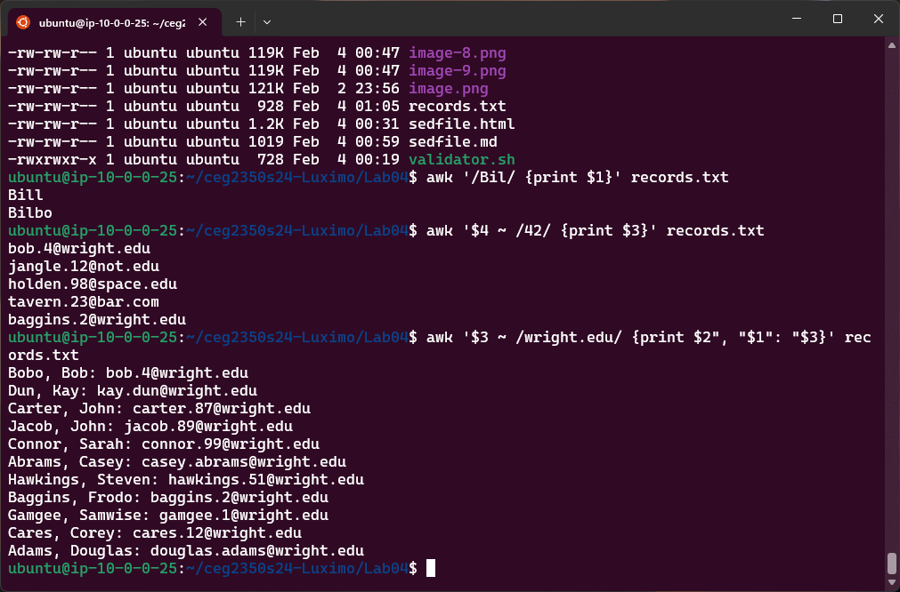

4. `awk '$3 ~ /wright.edu/ && $6 ~ /1234/ {print $1" favorite number is: "$4}' records.txt`
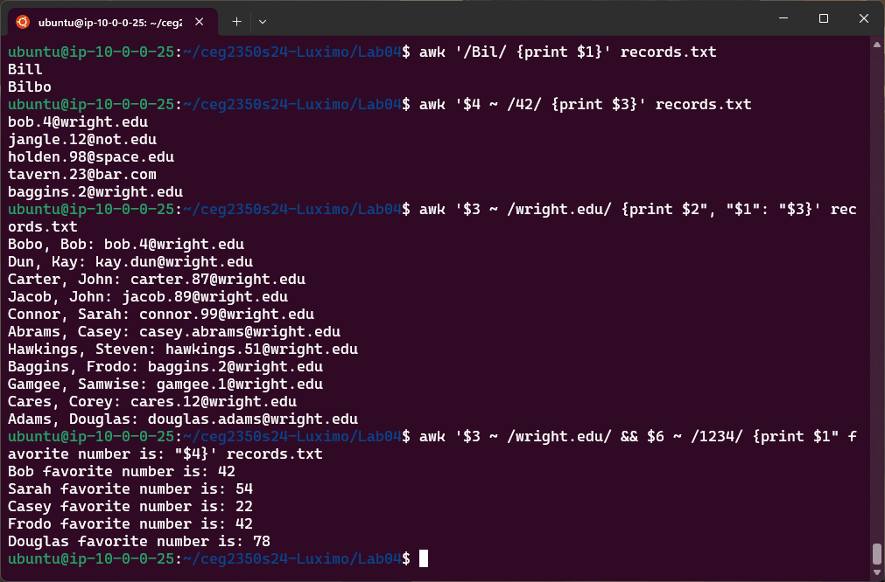

5. `awk '$6="N0T@PL@!NP@$$W0RD" {print $0}' records.txt > updaterecords.txt`
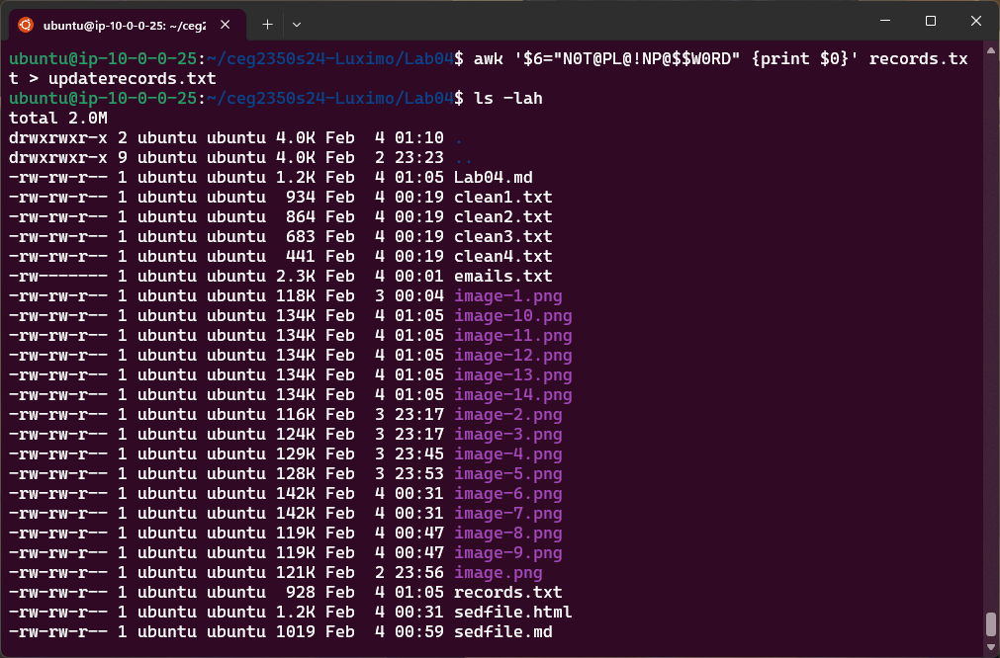
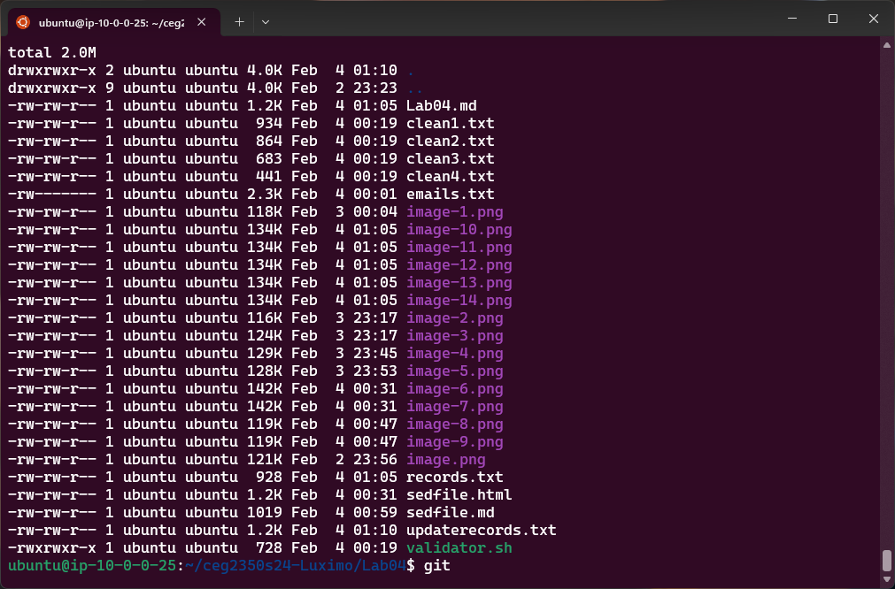


## Extra Credit - Remove this if not doing

1. Source: `https://stackoverflow.com/questions/201323/how-can-i-validate-an-email-address-using-a-regular-expression`

    - Regular Expression Pattern: ``/^(?:[a-z0-9!#$%&'*+/=?^_`{|}~-]+(?:\.[a-z0-9!#$%&'*+/=?^_`{|}~-]+)*|"(?:[\x01-\x08\x0b\x0c\x0e-\x1f\x21\x23-\x5b\x5d-\x7f]|\\[\x01-\x09\x0b\x0c\x0e-\x7f])*")@(?:a-z0-9?\.)+a-z0-9?$/``

2. Pattern explanation: 
- The symbol `/` that is situated at the commencement and termination of the expression are demarcators that indicate the initiation and culmination of the regular expression.

- The symbols `^` and `$` are moorings that correspond to the initiation and culmination of the input sequence, respectively. This guarantees that the entire sequence is a email address, not merely a segment of it.

- The symbols `(?:...)` are non-retentive aggregations that conjoin a succession of characters without preserving them in a variable. They are utilized to administer quantifiers or alternation to a group of characters.

- The symbols `[a-z0-9!#$%&'*+/=?^_{|}~-]+` correspond to one or more characters from the collection of minuscule letters, numerals, and some exceptional characters. These are the permissible characters for the provincial segment of the email address, anterior to the `@ `symbol.

- The symbols `(?:\.[a-z0-9!#$%&'*+/=?^_{|}~-]+)*` correspond to zero or more incidences of a dot (`.`) succeeded by one or more characters from the identical collection as above. This permits for dots to segregate segments of the provincial segment, as long as they are not at the commencement or termination of the provincial segment, or successive.

- The symbol `|` is the bifurcation operator that corresponds to either the expression anterior or posterior to it. This enables for two feasible formats for the provincial segment: either a succession of characters from the collection above, conceivably segregated by dots, or a cited string.

- The symbols `"(?:[\x01-\x08\x0b\x0c\x0e-\x1f\x21\x23-\x5b\x5d-\x7f]|\\[\x01-\x09\x0b\x0c\x0e-\x7f])*"` correspond to a double quote (`"`) succeeded by zero or more incidences of either a character from the collection of ASCII codes from `1` to `8, 11 to 12, 14 to 31, 33, 35 to 91, 93 to 127,` or a backslash (`\`) succeeded by any ASCII character from `1` to `9, 11 to 12, 14 to 127.` These are the permissible characters for the cited string format of the provincial segment, which can encompass any ASCII character except for the double quote and the backslash, unless they are eluded by a backslash. The cited string culminates with another double quote (`"`).

- The symbol `@` matches the literal `@` symbol that separates the local part and the domain of the email address.

- The symbols `[a-z0-9]` correspond to a solitary character from the collection of minuscule letters and numerals. These are the permissible characters for the domain of the email address, along with the hyphen (`-`).

- The symbols `(?:[a-z0-9-]*[a-z0-9])?` correspond to zero or one incidence of zero or more characters from the collection of minuscule letters, numerals, and hyphens, succeeded by a solitary character from the collection of minuscule letters and numerals. This enables for hyphens to segregate segments of the domain, as long as they are not at the commencement or termination of the domain, or successive.

- The symbol `\.` corresponds to a verbatim dot (`.`) that segregates the segments of the domain.

- The symbol `+` is a multiplier that corresponds to one or more incidences of the anterior expression. This guarantees that the domain has at least one dot, and therefore at least two segments.

- The symbols `a-z0-9?` correspond to the identical expression as anteriorly, but this time for the ultimate segment of the domain, which is customarily the top-level domain (`TLD`).


3. Verify `validator2` is in your GitHub repository