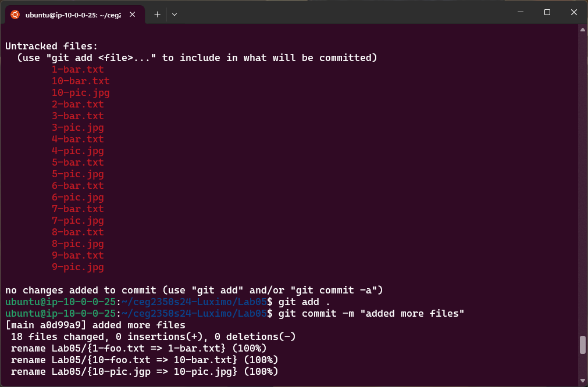

## Lab 05

- Name: Moses Otuvedo
- Email: Otuvedo.3@wright.edu

## Part 2 - Retrospective

1. Here is how I would likely try to explain `getopts` to a friend:😎

- Let's say you are a chef who needs to prepare a dish for a customer. You have a recipe that tells you what ingredients and steps you need to follow.🤔 However, the customer may have some special requests, such as adding more salt, using less oil, or avoiding certain allergens.🤨 How do you know what the customer wants and how to adjust your recipe accordingly...?🤔 Now let's begin...🫱🏾‍🫲🏼

- One way is to use `getopts.` `Getopts` is a tool that helps you read and process the customer’s requests. It works like this:

- The customer writes their requests on a piece of paper, using a special format. For example, they may write `“-s 2 -o 1 -a nuts”` to indicate that they want 2 teaspoons of salt, 1 tablespoon of oil, and no nuts in their dish...
- You read the paper and use `getopts` to interpret the requests. `Getopts` recognizes the letters that start with a dash, such as `-s`, `-o`, and `-a`, as options. These options tell you what kind of request the customer is making. For example, `-s` means salt, `-o` means oil, and `-a` means allergens...
- `Getopts` also recognizes the words or numbers that follow the options, such as `2`, `1`, and nuts, as arguments. These arguments tell you the specific value or detail of the request. For example, `2` means `2 teaspoons`, `1` means `1 tablespoon`, and `nuts` means `nuts...`
- `Getopts` assigns the options and arguments to variables that you can use in your recipe. For example, you can use the variable `$s` to store the value of the salt option, the variable `$o` to store the value of the oil option, and the variable `$a` to store the value of the allergen option...
- You can then use these variables to modify your recipe according to the customer’s requests. For example, you can add `$s` teaspoons of salt, use `$o` tablespoons of oil, and avoid using `$a` in your dish.
- Finally, that’s how `getopts` works. It helps you read and process the customer’s requests, so you can prepare the dish they want...

2. In all honesty, I encountered no obstacles whatsoever whilst working on this script. 😊 I possess a great deal of expertise and proficiency in writing bash scripts, so I managed to accomplish the task with ease. I also utilised some online resources and examples to validate my syntax and logic. Nevertheless, if I ever come across a problem that I am unable to resolve, I usually attempt to do the following: Decompose the problem into smaller and simpler subproblems. Seek relevant information and solutions online or in other sources. Test and debug my script using various inputs and outputs. Request assistance from someone who is more knowledgeable or experienced in the topic. These are some of the strategies that I employ to surmount challenges and acquire new skills...

3. I think I would add a recursive option to apply the find and replace operation to all the files in a given directory or subdirectory, instead of just one file...🤔

## Part 3 - namechange Usage Guide

NAMECHANGE SCRIPT (namechange.sh)

### What it is

- Namechange (`namechange.sh`) is a script that helps you rename files on your PC. It lets you specify a pattern of text that you want to find in the file name and a pattern of text that you want to replace it with. For example, you can use it to change the spaces in a file name to dashes or to correct a spelling mistake...

### How to run it

To use the script, you need to open a terminal window and type the following command:

1. `bash namechange -f find -r replace filename`
- where `find` is the text that you want to find in the `file name`, `replace` is the text that you want to replace it with, and `filename` is the name of the file that you want to rename.

2. For example, if you have a file named “`1-pic.jgp`” and you want to rename it to "`1-pic.jpg`”, you can type the following command:

-  `bash namechange.sh -f "jgp" -r "jpg" 1-pic.jgp`

- This will replace the wrong pattern (“`jgp`”) with the correct pattern (“`jpg`”) in the file name.

3. The script will then rename the file and print a message to confirm the change. For example, it will say:

- Renamed "`1-pic.jgp`" to `1-pic.jpg`

4. If the script cannot find the pattern in the file name, or if the file does not exist, it will print an error message and exit. For example, it will say:

- `User must provide valid filename`
or
- `No changes made to "1-pic.jgp"`

5. The script also has a help option that you can use to see the usage and description of what the script can do for you whenever you're stuck or something else. To use the help option, you can type the following command:

- `bash namechange.sh -h`

- This will print the following message:

```Usage: namechange -f find -r replace filename
 -f The text to find in the filename`
 -r The replacement text for the new filename
 ```
6. Finally, that’s how the script works. It helps you rename files on your computer by finding and replacing patterns of text in the file name. Easy right...?😇 *don't worry, I know...🫱🏾‍🫲🏼*

### Examples

```
$  bash namechange.sh -f "jgp" -r "jpg" 1-pic.jgp 
Renamed "1-pic.jgp" to 1-pic.jpg

$ bash namechange.sh -f "jgp" -r "jpg" 2-pic.jgp
Renamed "2-pic.jgp" to 2-pic.jpg
```

(some examples of the script in action with errors included)

## bulkrenamer Usage Guide

BULKRENAMER SCRIPT (bulkrenamer.sh)

### What it is

- Bulkrenamer (`bulkrenamer.sh`) is a script that helps you rename many files on your computer at once. It lets you specify a pattern of text that you want to find in the file names and a pattern of text that you want to replace it with. For example, you can use it to change the spaces in all the file names to dashes or to correct a spelling mistake in all the file names...

### How to run it

To use the script, you need to open a terminal window and type the following command:

1. `bash bulkrenamer.sh -f '"find"' -r '"replace"'`

- where `find` is the text that you want to find in the file names, and `replace` is the text that you want to replace it with.

2. For example, if you have many files that have spaces in their names, such as “`1 file name.txt`”, “`2 file name.txt`”, and “`3 file name.txt`”, and you want to rename them to have dashes instead of spaces, such as “`1-file-name.txt`”, “`2-file-name.txt`”, and “`3-file-name.txt`”, you can type the following command:

- `bash bulkrenamer.sh -f "\s" -r "-"`

- This will replace the space pattern (“`\s`”) with the dash pattern (“`-`”) in all the file names.

3. The script will then rename all the files and print a message to confirm the changes. For example, it will say:
- 
```Renamed "1 file name.txt" to 1-file-name.txt
   Renamed "2 file name.txt" to 2-file-name.txt
   Renamed "3 file name.txt" to 3-file-name.txt
```

4. If the script cannot find the pattern in any of the file names, it will print a message and exit. For example, it will say:

- `No changes made to any files`

5. The script also has a help option that you can use to see the usage and description of the script. To use the help option, you can type the following command:

- `bash bulkrenamer.sh -h`

6. This will print the following message:

```
 -f The text to find in the filenames
 -r The replacement text for the new filenames
 ```

7. That’s how the script works. It helps you rename many files on your computer at once by finding and replacing patterns of text in the file names. Easy right…?😇 *again..., I know…🫱🏾‍🫲🏼*


### Examples

```
$ bash bulkrenamer.sh -f "jgp" -r "jpg" *
Renamed "1-pic.jgp" to 1-pic.jpg
Renamed "2-pic.jgp" to 2-pic.jpg
Renamed "3-pic.jgp" to 3-pic.jpg
Renamed "4-pic.jgp" to 4-pic.jpg
Renamed "5-pic.jgp" to 5-pic.jpg
Renamed "6-pic.jgp" to 6-pic.jpg
Renamed "7-pic.jgp" to 7-pic.jpg
Renamed "8-pic.jgp" to 8-pic.jpg
Renamed "9-pic.jgp" to 9-pic.jpg
Renamed "10-pic.jgp" to 10-pic.jpg

$ bash bulkrenamer.sh -f "foo" -r "bar" *
Renamed "1-foo.txt" to 1-bar.txt
Renamed "2-foo.txt" to 2-bar.txt
Renamed "3-foo.txt" to 3-bar.txt
Renamed "4-foo.txt" to 4-bar.txt
Renamed "5-foo.txt" to 5-bar.txt
Renamed "6-foo.txt" to 6-bar.txt
Renamed "7-foo.txt" to 7-bar.txt
Renamed "8-foo.txt" to 8-bar.txt
Renamed "9-foo.txt" to 9-bar.txt
Renamed "10-foo.txt" to 10-bar.txt
```

8. 
(some examples of the script in action)