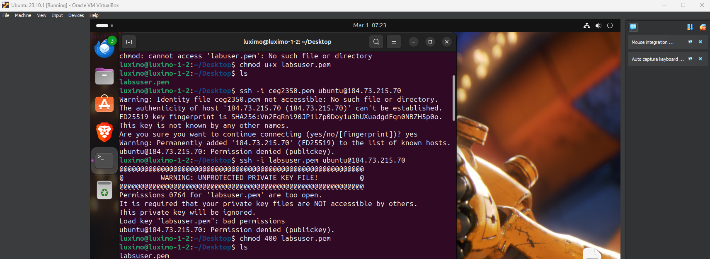

## Lab 06

- Name: Moses Otuvedo
- Email: Otuvedo.3@wright.edu

## System Discovery

1. CPU info:
    - CPU brand: `AMD`
    - Number of cores: `8 cores`
    - Number of logical cores: `16 logical cores`

2. GPU info:
    - Integrated GPU info: `none available yet`
    - Dedicated GPU info: `My MSI RX 6650 XT MECH 2X 8G OC is built on the AMD RDNA 2 architecture, featuring 2048 cores and a boost clock of up to 2635 MHz. It has 8GB of GDDR6 memory and supports DisplayPort 1.4a and HDMI 2.1.`
    - Link to driver software for GPU: `https://drivers.amd.com/drivers/whql-amd-software-adrenalin-edition-24.2.1-win10-win11-feb26-rdna.exe`

3. Memory info:
    - Physical memory (RAM) size (in GB): `24.0 GB`
    - Virtual memory size (in GB): `72 GB Max`

4. Storage info (repeat for each disk attached to your system): 
    - Disk 1 type: `SSD`
    - Disk 1 manufacturer and model: `WD_BLACK SN850X HS 2000GB`
    - Total disk 1 size (in GB): `2 TB`

    - Disk 2 type: `SSD`
    - Disk 2 manufacturer and model: `WD_BLACK SN850X HS 2000GB`
    - Total disk 2 size (in GB): `2 TB`

    - Disk 3 type: `SSD`
    - Disk 3 manufacturer and model: `WD_BLACK SN850X HS 2000GB`
    - Total disk 3 size (in GB): `2 TB`

5. Primary partition info:
    - Primary partition mount point: `C: drive`
    - Remaining space on primary partition (in GB): `205 GB`
    - Filesystem on primary partition: `NTFS`

6. BIOS / UEFI info: 
    - BIOS or UEFI version: `LENOVO O4MKT29A, 04/01/22`
    - How to access your BIOS / UEFI:
        - How to access your BIOS / UEFI: 
        - Open the Settings app by pressing `Windows key + I.`
        - Go to `System` then `Recovery.`
        - Under `Advanced startup`, click `Restart now.`
        - After my PC restarts, click `Troubleshoot` then `Advanced options` then `UEFI Firmware Settings.`
        - Click `Restart` to reboot into my BIOS or UEFI firmware settings.

7. Kernel / OS info:
    - Bootloader software on your system: `Windows Boot Manager`
    - Kernel version of your operating system: `10.0.22621.2506`
    - Operating System name & version: `Windows 11 Pro & version 23H2`

## Part 2 - Virtualize the Machine

1. Virtual Machine Manager:
    - Software & version: `VirtualBox 7.0`
    - Link to software URL: `https://download.virtualbox.org/virtualbox/7.0.14/VirtualBox-7.0.14-161095-Win.exe`
    - 
    - 

2. Guest OS information: 
    - Linux distribution selected: `Ubuntu 23.10`
    - URL downloaded from: `https://ubuntu.com/download/desktop/thank-you?version=23.10.1&architecture=amd64`

3. Guest VM resource allocations:
    - Number of Virtual CPUs: `4`
    - RAM: `8 GB`
    - Hard disk space: `51.76 GB`

4. Guest OS Installation:
    - Note steps completed to install and then run the guest operating system
    - 
    
## Part 3 - Virtual Playground:

1. How to change your desktop background in your VM:
    - Right click on desktop and choose "Change Background" option
    
    - Select the picture you like, then exit
    

2. How to install VSCode in your VM:
    - Open `App Center`
    
    - Search for `VSCode`
    
    
    - Click `install`
    
    - Enter `admin password` when prompted
    

3. How to connect to your AWS instance from your VM using `ssh`:
    - This is the tricky part...🥲
    - Copy your `labsuser.pem key` and `config file` to your VM using `drag and drop`
    (if it doesn't work, make sure drag and drop is enabled and set to bidirectional)
    - Open `terminal` in VM
    
    
    - Navigate to `Desktop`
    
    - Set `permissions` for only yourself to read the private key file. If you set the permissions to multiple users instead of you alone, this is what you get when you connect via ssh.
    
    - Then connect like how you used to in your `Host OS ubuntu terminal` and `boom!` you're good...!😎 *cool...I know right...?🫱🏾‍🫲🏼*
    
    
    
