## Lab 07

- Name: Moses Otuvedo
- Email: Otuvedo.3@wright.edu

## Part 1

1. Command:
```
lsblk -o NAME,SIZE,FSTYPE,LABEL,MOUNTPOINT /dev/xvda

```
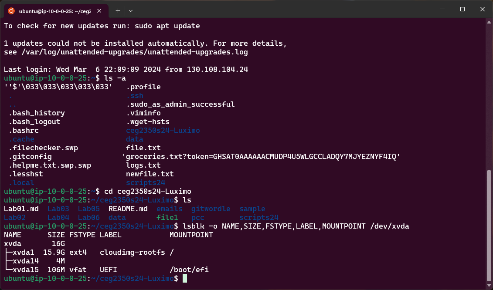

2. Command:
```
sudo parted /dev/xvda print
or 
sudo parted /dev/xvda print all

```
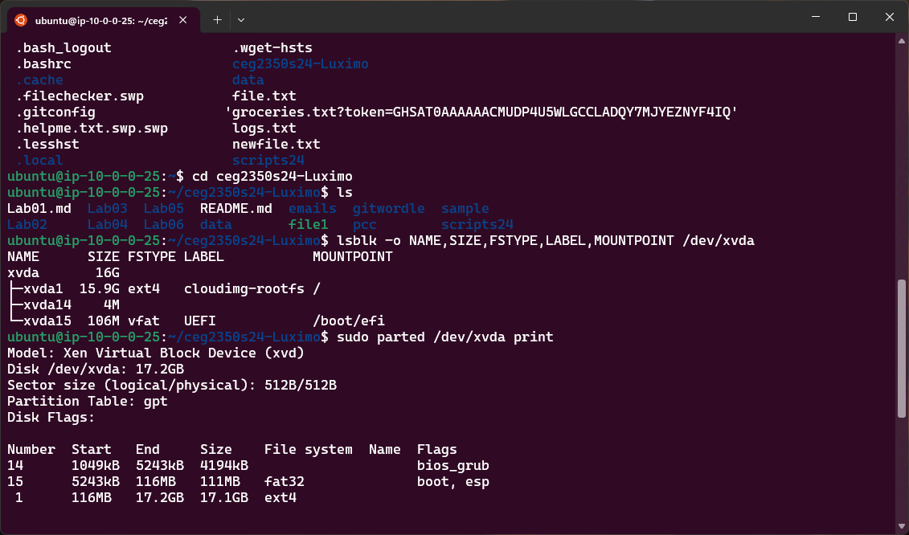
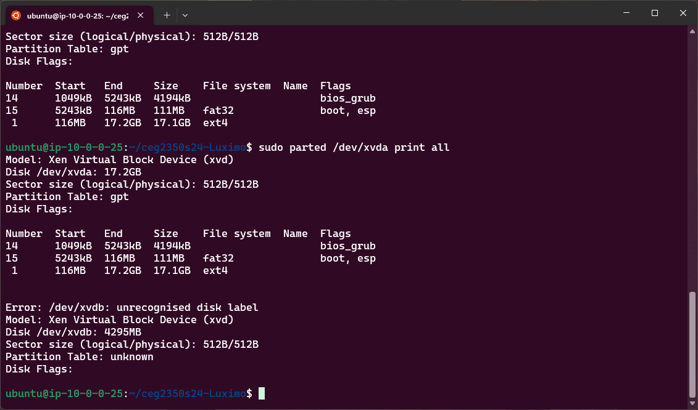


3. For the `xvda` partition table:
    - Does it use MBR or GPT? 
      -  Answer: `GPT`

    - How many partitions are on the block device?
      -  Answer: `3 partitions on the block.`

    - What is the largest partition?
      - Answer: `Partition 1 with size 17.1GB`

4. Command:
```
sudo blkid /dev/xvda

```
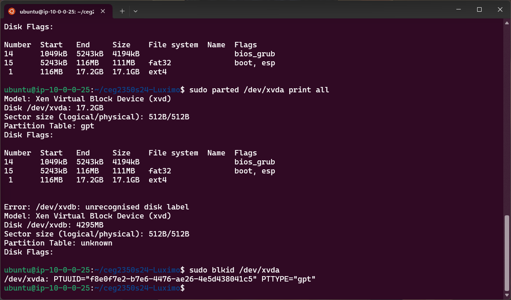

5. For the primary partition:
    - What partition is the root filesystem on?
      -  Answer: `Partition 1`

    - What is the partition label?
      -  Answer: `cloudimg-rootfs`

    - What type of filesystem is on the partition?
      -  Answer: `ext4`
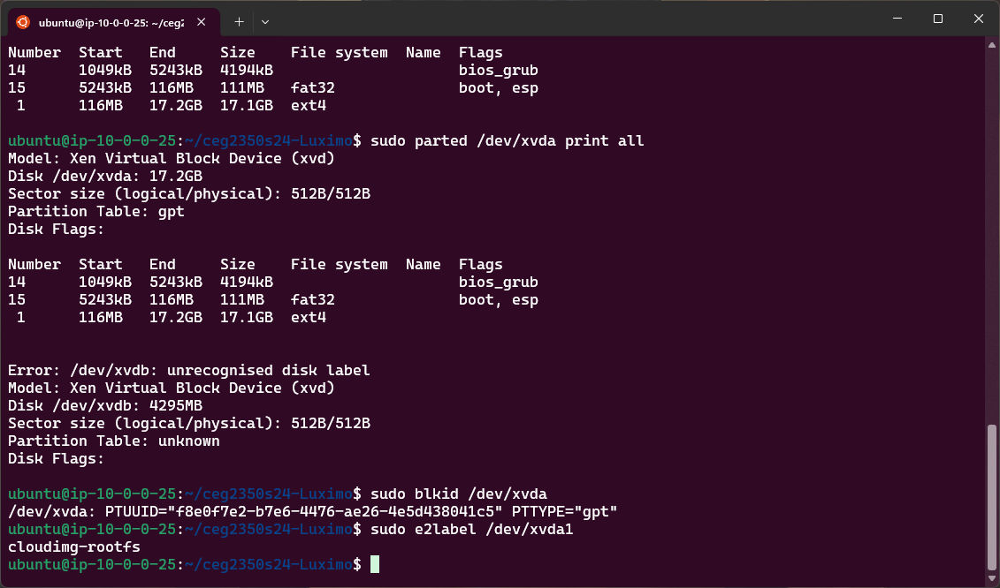

6. Command:
```
df -h

```
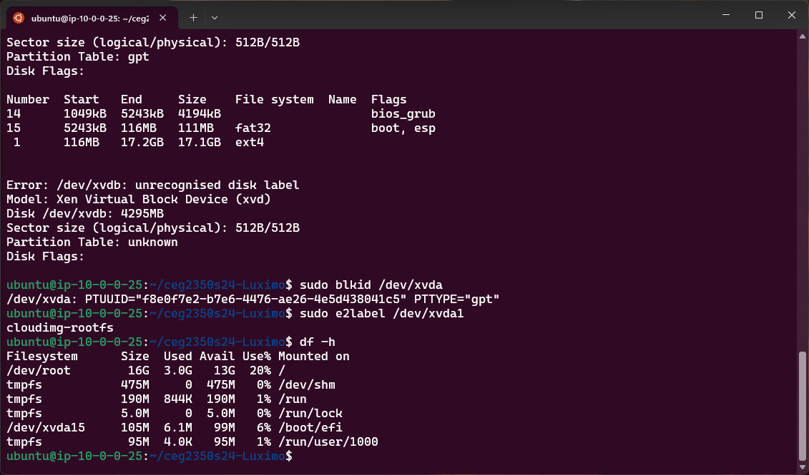

7. For the root filesystem:
    - What is the total size?
      -  Answer: `16 G`

    - How much space is used?
      -  Answer: `3.0G`
    - Where is it mounted to?
      -  Answer: `/`
8. Command:
```
cat /etc/fstab

```
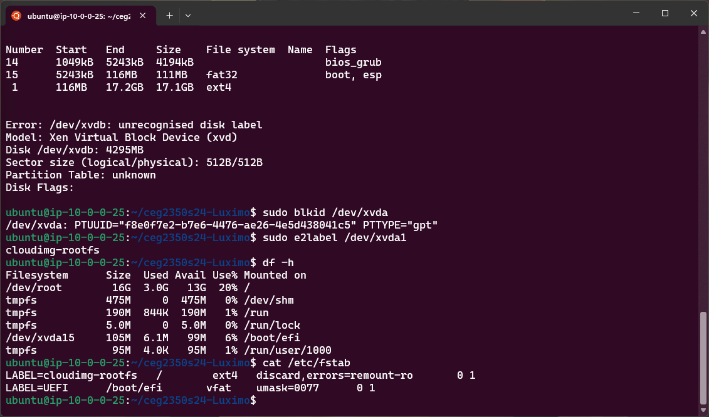

9. Fields & purpose of fields in entry that mount the root filesystem

- The `/etc/fstab` file contains entries that define how disk partitions should be mounted into the filesystem. Here’s an explanation of the fields for the entry that mounts the root filesystem:

   -  Device: `LABEL=cloudimg-rootfs` indicates that the device with the label `cloudimg-rootfs` is to be mounted.
   -  Mount Point: `/` signifies that this filesystem is mounted at the root directory.
   -  File System Type: `ext4` specifies the type of the filesystem.
   -  Options: `discard,errors=remount-ro` are the mount options. `discard` enables discard/TRIM support for SSDs, and `errors=remount-ro` means that if an error is encountered, the filesystem should be remounted as read-only.
   -  Dump: The `0` indicates that the filesystem will not be dumped.
   -  Pass: The `1` signifies that the filesystem will be checked at boot time; the root filesystem is always checked first.
   -  This entry ensures that the root filesystem is properly mounted with the appropriate options for optimal performance and reliability. The `UEFI` entry is for the `EFI` system partition, which is necessary for booting on UEFI systems. It’s mounted at `/boot/efi` and uses the `vfat` filesystem with strict permissions `(umask=0077)`, and it’s also checked at boot time.

## Part 2

1. `gdisk` main menu options
   - `p`: Prints the partition table, showing a detailed list of all partitions on the disk along with their sizes, types, and other information.
   
   - `o`: Deletes all partition data and creates a new GPT (GUID Partition Table), effectively wiping the disk.
   
   - `n`: Adds a new partition, prompting you to specify the starting and ending sectors or size, and to choose a type for the partition.

   - `i`: Shows detailed information about a specific partition when you enter its number, including the filesystem type, UUID, and other attributes.
   
   - `w`: Writes the changes you’ve made to the partition table to the disk and exits gdisk. This action is irreversible, so it’s important to be sure before saving the changes.
   
2. Partition table on `/dev/xvdb`
```
ubuntu@ip-10-0-0-25:~/ceg2350s24-Luximo$ sudo gdisk /dev/xvdb
GPT fdisk (gdisk) version 1.0.8

Partition table scan:
  MBR: not present
  BSD: not present
  APM: not present
  GPT: not present

Creating new GPT entries in memory.

Command (? for help): n
Partition number (1-128, default 1): 1
First sector (34-8388574, default = 2048) or {+-}size{KMGTP}: 2048
Last sector (2048-8388574, default = 8388574) or {+-}size{KMGTP}: 8388574
Current type is 8300 (Linux filesystem)
Hex code or GUID (L to show codes, Enter = 8300): 8300
Changed type of partition to 'Linux filesystem'

Command (? for help): w

Final checks complete. About to write GPT data. THIS WILL OVERWRITE EXISTING
PARTITIONS!!

Do you want to proceed? (Y/N): Y
OK; writing new GUID partition table (GPT) to /dev/xvdb.
The operation has completed successfully.
```
3. Steps to create a partition table and partition on `xvbd`

-  Launched `gdisk` on the target device with `sudo gdisk /dev/xvdb`
-  Created a new GPT partition table in memory since none was present.
-  Added a new partition (`n`) with:
      -  Partition number: `1`
      -  First sector: `2048` (default start)
      -  Last sector: `8388574` (end of the available space)
      -  Type: `8300` (Linux filesystem)
-  Save the changes to the disk (`w`) and confirm it.
-  The xvdb device now has a single Linux filesystem partition spanning the available space. Remember, if you need to format the partition or mount it, you’ll need to use additional commands like mkfs and mount. Always ensure to back up any important data before making changes to disk partitions.
-  Below is the image of the partition table and the partition on `xvdb` I created above.
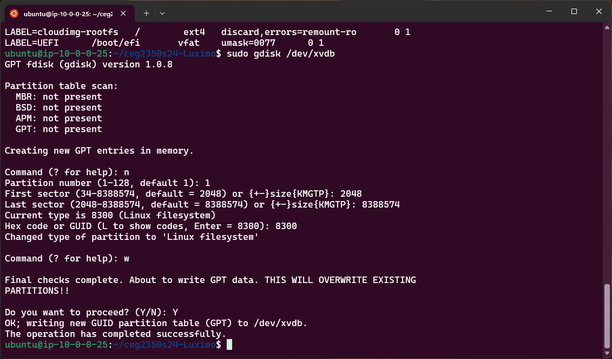

4. Answer these questions:
   
   a. What device name does the partition use?
      - Answer: `/dev/xvdb1`
        
   b. What size is the partition in GB?
      - Answer: huh, that's a tricky question🤔 but I calculated `4 GB` using the formula below
      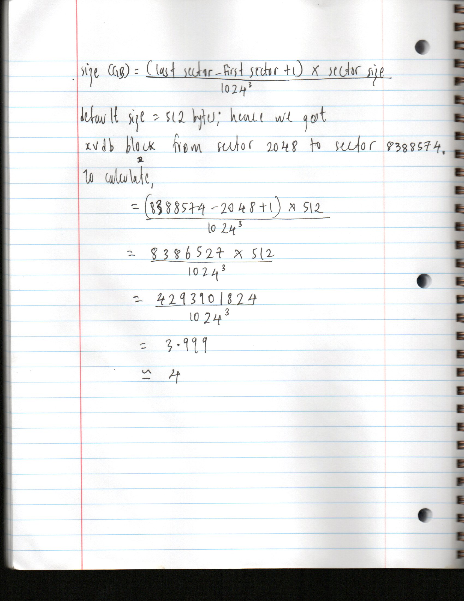
        
   c. What filesystem type will be used on the partition?
      - Answer: `Linux filesystem`

## Part 3

1. Commands used: `sudo mkfs -t ext4 -L lux_fs /dev/xvdb1`
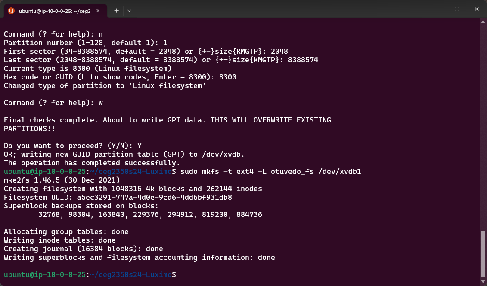

2. Commands used: `sudo mount /dev/xvdb1 /mnt/newworld`

3. Commands used: `sudo mount /dev/xvdb1 /mnt/newworld`

4. Contents of `/mnt/newworld`:
```
/mnt/newworld$ sudo vim test1.txt
/mnt/newworld$ ls
newworld1  newworld12  newworld13  test1.txt
```
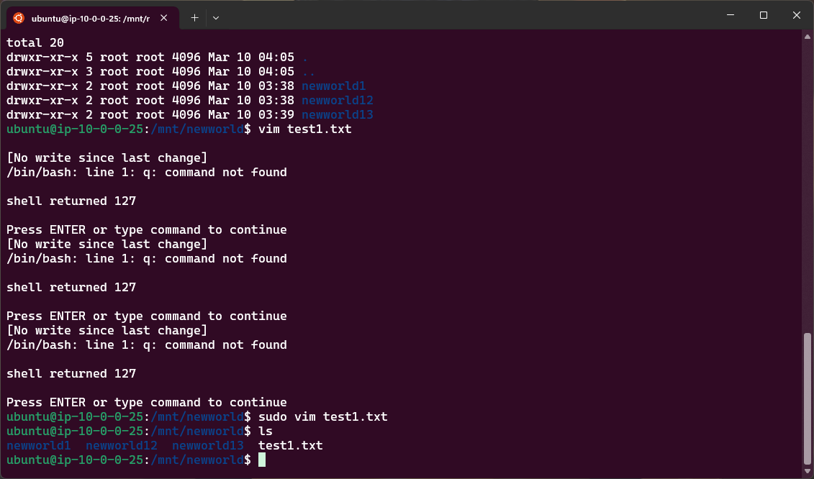

5. Commands used: `sudo umount /dev/xvdb1`

6. When can I interact with files on the filesystem on the partition in `xvdb`?
   - Answer: 
          - Created the partition, which I've done with `gdisk`
          - Formatted the partition with a filesystem, which I’ve done with `mkfs -t ext4`
          - Created a mount point, which I’ve done with `mkdir /mnt/newworld`
          - Mounted the filesystem to the mount point, which I did with the command `sudo mount /dev/xvdb1 /mnt/newworld`
          - Once the filesystem is mounted, you can start interacting with files on it, such as creating, editing, and deleting files and directories. Remember to unmount the filesystem with sudo umount /mnt/newworld when you’re done working with it to ensure all changes are written to disk and to prevent data corruption.
   
## Part 4

1. Commands used: `sudo cp /etc/fstab /etc/fstab.bak`

2. Line you added to `/etc/fstab`: 
- Answer: `UUID=a5ec3291-747a-4d0e-9cd6-4dd6bf931db8 /mnt/newworld ext4 defaults 0 2`
3. How did you confirm that the mount point changed? (Commands used or explain process):

- To confirm that the mount point has changed and the partition on `xvdb` is correctly mounted to `/mnt/newworld`, you can use the mount command or the `df` command. Here’s how you can use these commands:

- Using mount Command: You can filter the output of the mount command to show only the relevant information about `xvdb1`. Run:
  ```
  mount | grep xvdb1
  ```
    - This will display the mount details of the `xvdb1` partition, showing that it is indeed mounted to `/mnt/newworld`
    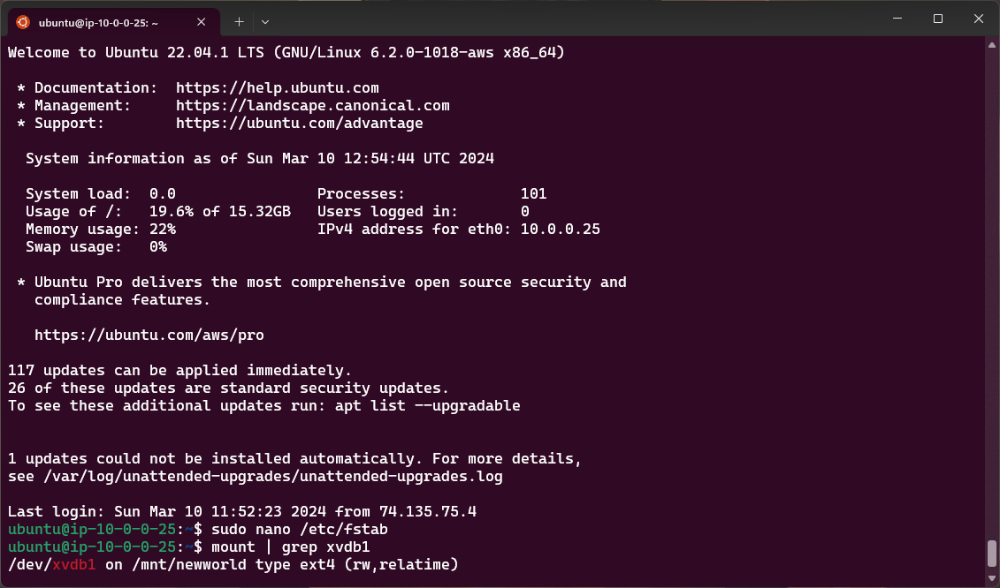
- Using df Command: The `df` command shows the disk space usage of all mounted filesystems. To see the details of `xvdb1`, run:
  ```
  df -h | grep xvdb1
  ```
    - This will display the disk space usage for `xvdb1`, including its mount point, which should be `/mnt/newworld`
    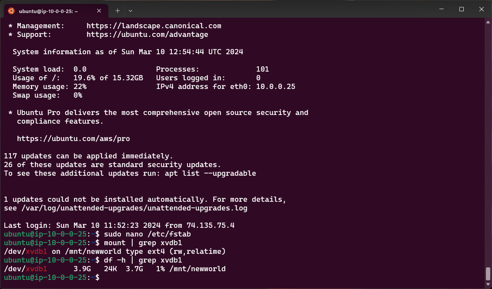
- Since the output of either command includes `/mnt/newworld`, it confirms that the filesystem on the `xvdb1` partition is mounted to the correct mount point...😎

4. **If you restored `/etc/fstab`**, write here why you did not feel comfortable leaving your changes in place.
- Answer: I didn't encounter any problems yet...🤔


## Part 5

1. Commands used: 
    - `nano secret1.txt`
    - `nano secret2.txt`

2. What does the `strings` command do?
   - Answer: The `strings` command in Linux is used to extract printable strings from binary or non-text files. It scans the files to search for sequences of readable characters.

3. Write a short explanation of what you saw in `strings` output:

- Here’s an analysis of the output:

- Filesystem Labels and Mount Points: The strings `otuvedo_fs` and `/mnt/newworld` likely refer to the label of the filesystem and the mount point directory, respectively.
- Directory Entries: The `lost+found` directory is a special directory used by the filesystem to recover files after a system crash or disk check.
- File Names: Entries like `secret1.txt` and `secret2.txt` are the names of files that were present on the filesystem.
- File Contents: The lines following the file names, such as “`I have lose so many friends growing up for being brutally honest 'bout anything…`” and “`So many mysteries in life, and I plan to explore 'em all as much as I can till my dying breath… Digital forensics, here we go!`” are the contents of the files `secret1.txt and secret2.txt`.
- Swap Files: Entries ending with `.swp` are swap files, which are temporary files created by text editors like Vim or Nano...?🤔
- User and Host Information: The strings `root` and `ip-10-0-0-25` indicate the user and host that were involved in creating or modifying the files.


4. Commands used: `sudo rm /mnt/newworld/secret1.txt`
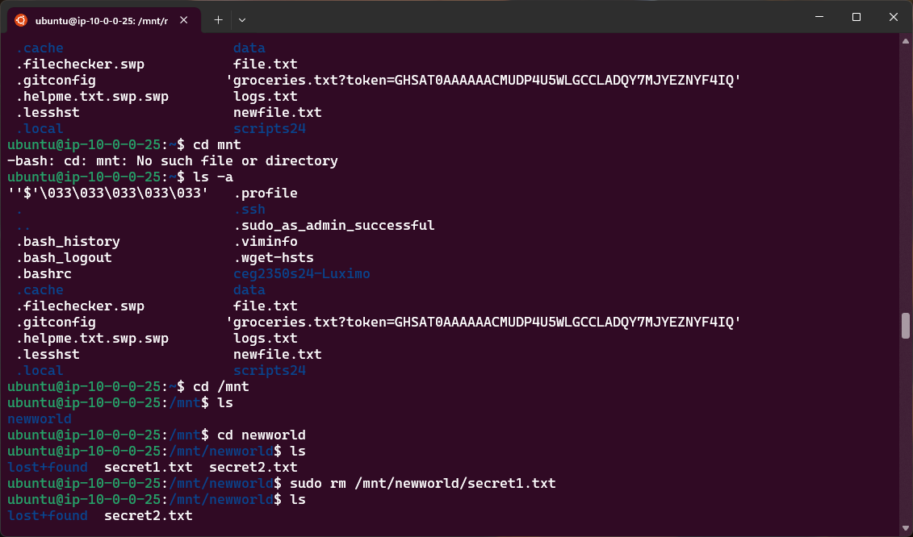

5. Is the secret you deleted still showing up in the `strings` output?
- Answer: yep, not deleted yet...
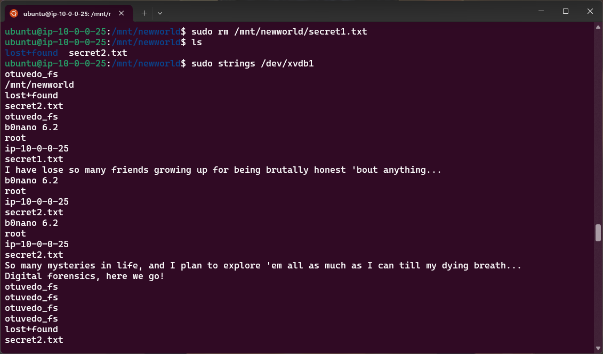
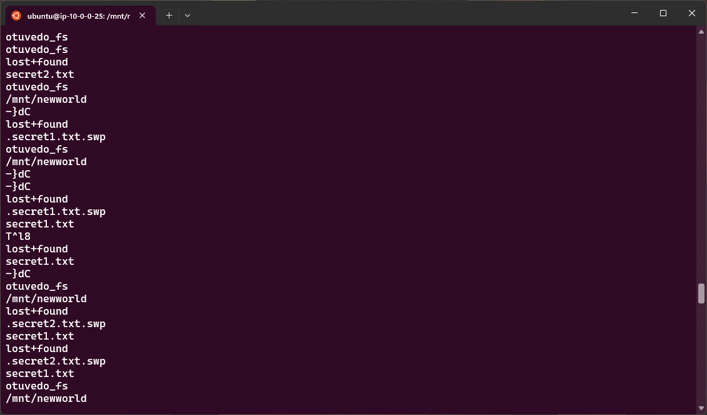
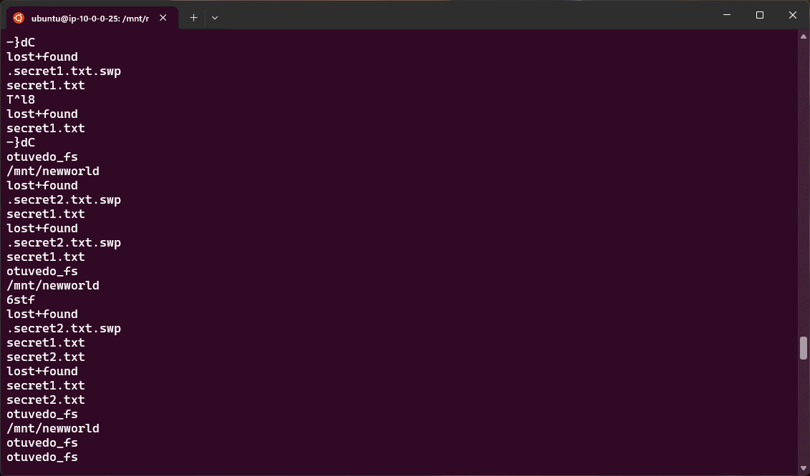

### Report: How to Permanently Delete a File

**
- To permanently delete a file using my above example (`secret2.txt`),
  - I would run the following command:
  ```
  sudo shred -u /mnt/newworld/secret2.txt
  ```
  - The `-u` option removes the file after overwriting it.
  - After using the `shred` command above, if you run `strings` on the partition again:
  ```
  sudo strings /dev/xvdb1
  ```
  - You should no longer be able to find the contents of `secret2.txt`, proving that the file has been permanently deleted and its contents overwritten on the disk too...!😲 so freakishly cool...!😎

**

## Extra Credit Answers:

1. Commands used: `dd if=/dev/zero of=~/vm-disk.img bs=1M count=2048`

2. Explanation: 
- The `dd` command is a low-level utility that can copy data from one location to another. In this case, it's being used to create a file of a specified size by reading null characters from `/dev/zero` and writing them to the output file `~/vm-disk.img`. The `bs=1M` option sets the block size to `1 megabyte`, and `count=2048` tells dd to copy `2048 blocks`, resulting in a `2 GB` file.

3. Commands used: `sudo mkfs.ext4 ~/vm-disk.img`
- the `mkfs.ext4` command creates an `ext4 filesystem` on the specified file.

4. Commands used: 
```
sudo mkdir -p /mnt/vfs
sudo mount -o loop ~/vm-disk.img /mnt/vfs
```
- `mkdir -p /mnt/vfs` creates the mount point directory if it doesn’t already exist.
- `mount -o loop` mounts the image file as a loop device, which allows a file to be treated as a block device.

- Below is the image description of the commands used above:
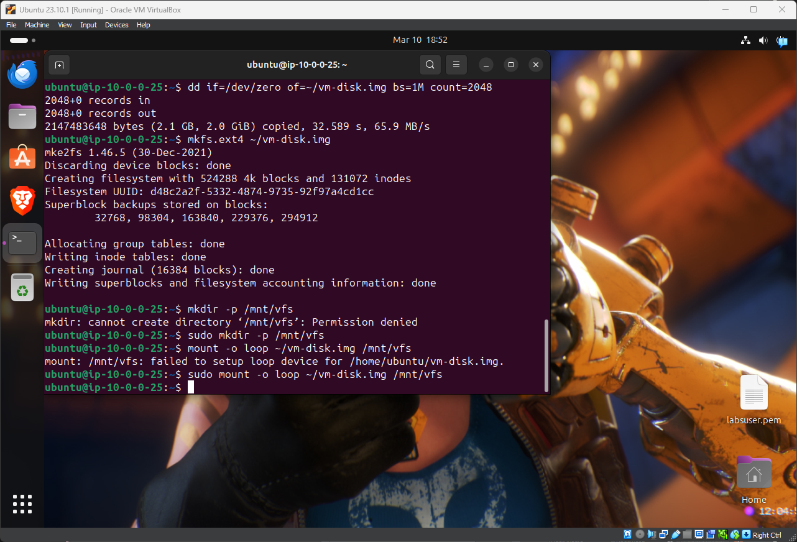
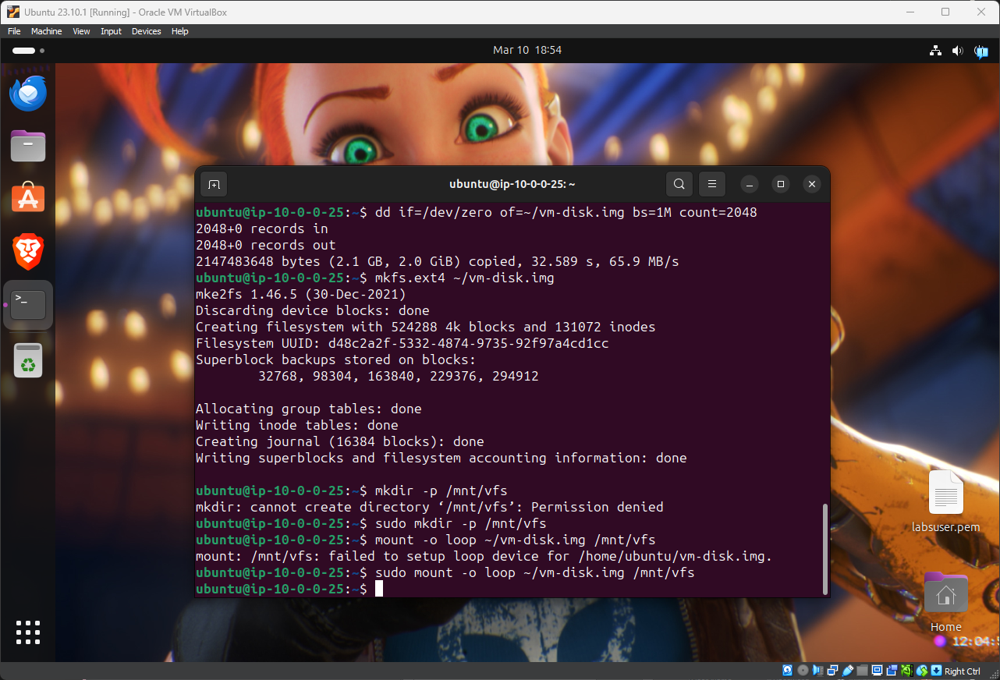
