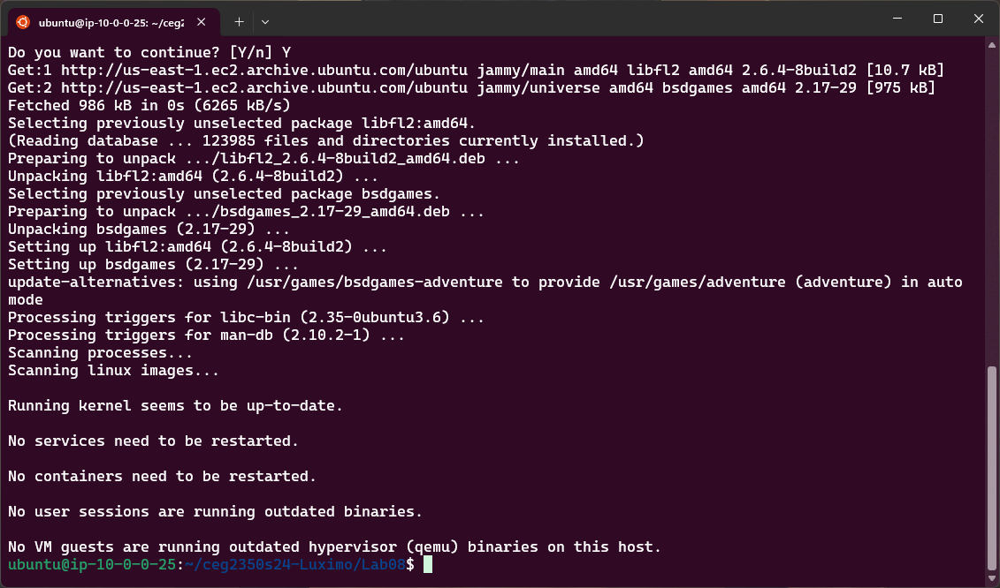

## Lab 08

- Name: Moses Otuvedo
- Email: Otuvedo.3@wright.edu

## Part 1 - Game the system

- Game name: `Air Traffic Controller`

- How to install: `sudo apt install bsdgames`



- Location of game executable: `which atc`


- How to run game: `atc`


## Part 2 - Process Control

1. `ps` field descriptions:
   - USER / UID: This designation delineates the appellation or unique identifier ascribed to the proprietor of the process.
   -  `Ubuntu / 1000`

   - PID: An acronym for Process Identifier, this is an exclusive numerical label allocated to each operative procedure.
   -  `840`

   - PPID: Denoting Parent Process Identifier, this numeric value corresponds to the progenitor process that engendered the current operation.
   -  `732`

   - TTY: This abbreviation signifies the terminal interface archetype to which the user is actively connected.
   -  `pts/0`

   - STAT: This parameter articulates the current disposition of the process, encompassing states such as active execution, dormancy, cessation, or defunct status.
   -  `S`

   - COMMAND / CMD: This entry exhibits the precise command line invocation that initiated the process in question.
   -  `sshd: ubuntu@pts/0`
   
   

2. `ps` command: `ps -u $(whoami) -o user,uid,pid,ppid,tty,stat,cmd | grep ' ? '`


3. Output of `ps` with two shells, one running the game:
```
ubuntu    1000    1326     843 pts/0    S+   atc
ubuntu    1000    1328    1202 pts/1    S+   grep --color=auto atc
```
4. For the game:
   - Process id: `1326`
   - Parent process id: `843`
   - What is the parent process: The parent process is the shell instance (`-bash`) from which you started the game. This is indicated by the `PPID 843`, which corresponds to the bash shell running on `pts/0` as shown in my previous ps output I mentioned earlier.
   

5. `kill` to kill only the game: `kill 1326`
   - Describe what the effect was: After running the above command, the ‘`atc`’ game process got terminated. The effect of this command is that the game will stop running, and you will be returned to the command prompt in `Shell A`. If the game was running in the foreground, My terminal become free for new commands. If there were any temporary files or resources being used by the game, they would be released or deleted, depending on how the game handles my termination commands.
   
   

6. `kill` to kill the game and it's parent process: 
```
kill 1442
kill 1443
```
   - Describe what the effect was:
      -  The `kill 1442` command terminate the game process. If the game was running in the foreground of `Shell A`, it would stop and return me to the command prompt.
      -  The `kill 1443` command terminate the parent process, which is the bash shell from which I started the game. This would effectively close `Shell A`, logging me out of that session.

7. Describe what happens if you close / `exit` your connection with Shell C and determine if you can reenter the game (resume the process).
   - Answer: 
      - The SSH session is terminated, which sends a SIGHUP (hang-up signal) to the running processes associated with that session.
      -  The game process receives the `SIGHUP signal`. By default, this signal causes the process to terminate because it’s no longer attached to a controlling terminal as expected.
      -  Since the game process is terminated, it cannot be resumed or reentered which is expected but there's another way I tried after researching. The process ceases to exist, and its PID is freed up by the system.
      -  To reenter the game, I would typically need to use job control commands like `bg` to run the process in the background or `disown` to detach the process from the shell before closing the SSH session. However, these commands work for shell jobs, and since ‘`atc`’ is not a job but an independent process, it cannot be resumed once the SSH session is closed and the process is terminated.
      -  If you want to keep the game running after disconnecting from `Shell C`, you could use utilities like `screen` or `tmux`, which allow you to detach from a session and reattach later, keeping the processes running inside them  to remain active. These tools create a persistent session that is not dependent on the SSH connection being open. Here’s how you could do it with `screen` command:
      -  Start a new `screen` session in `Shell C` by typing `screen`.
      -  Run the game inside the `screen` session.
      -  Detach from the `screen` session by pressing `Ctrl-A` followed by `D`.
      -  You can now safely exit `Shell C`; the game will continue to run inside the detached screen session.
      -  To reattach to the screen session and resume the game, reconnect via SSH and type `screen -r`.
      
      
      

## Part 3 - back and fore

1. Run in the foreground: `atc`

2. `STOP` signal to suspend it: `Ctrl plus Z`

3. Proof of life from `ps` output: 
```
   1729 pts/1    T    atc
   1730 pts/1    T    atc
   1731 pts/1    T    atc
   1733 pts/1    S+   grep --color=auto atc
```
4. Resume in the foreground: `fg`

5. `TERMINATE` signal to kill it: `Ctrl-C`

6. Start as a background process:
```
atc &
atc &
atc &

```

7. Output of `jobs` from controlling terminal:
```
[1]   Stopped                 atc
[2]-  Stopped                 atc
[3]+  Stopped                 atc
```
-  Output of `ps`:
```
   1729 pts/1    T    atc
   1730 pts/1    T    atc
   1731 pts/1    T    atc
   1733 pts/1    S+   grep --color=auto atc
```

8. Kill job:
   - First, list the jobs to get their job numbers: `jobs`
   - Second, then kill one of the jobs using its job number: `kill %1`

9. Move job to the foreground: `fg %2`

10. Describe what happens, using process knowledge in your description, if you close / `exit` your connection with this shell and determine if you can reenter the game (resume the process).
   - Answer: 
      -  Session Termination: Closing the shell sends a SIGHUP (hang-up signal) to the session leader (the shell), which then propagates to child processes (in this case, the game processes).
      -  Default Signal Handling: By default, when background processes receive a SIGHUP, they will terminate because they are losing their controlling terminal.
      -  Process Termination: The game processes will be terminated and cannot be resumed or reentered because they no longer exist in the system’s process table.
      -  No Reentry: Since the processes are terminated, you cannot reenter the game or resume the processes. They were not detached from the controlling terminal, and no session management tool like screen or tmux was used to keep them running independently of the shell session.
      -  If you want to keep the game running after disconnecting, you would need to use a session manager like screen or tmux before starting the game. These tools allow you to detach from a session and later reattach, resuming interaction with the game process.
      
      

## Part 4 - Detach

1. Create a `tmux` session: `tmux new -s game_session`

2. Detach from the session: Press `Ctrl plus B` followed by `D` to detach from the tmux session.

3. `ps` command: `ps -u $(whoami) -o pid,tty,stat,cmd | grep -v 'pts'`

```
    PID TT       STAT CMD
    735 ?        Ss   /lib/systemd/systemd --user
    736 ?        S    (sd-pam)
   1531 ?        Ss   SCREEN
   1745 ?        Ss   tmux new -s game_session
```

4. Command to list `tmux` sessions: `tmux ls`
```
game_session: 1 windows (created Sat Mar 16 05:34:11 2024)
```

5. How can you determine if your `tmux` session with your game running is available?
   - Answer: we run this command first `tmux ls` then look for game_session in the output to confirm it’s still running.

7. Reattach to `tmux` session: `tmux attach -t game_session`

8. Kill `tmux` session:
   -  We first end the game normally by pressing space bar
   -  then run this command again to end the session `tmux kill-session -t game_session`
   
   
   