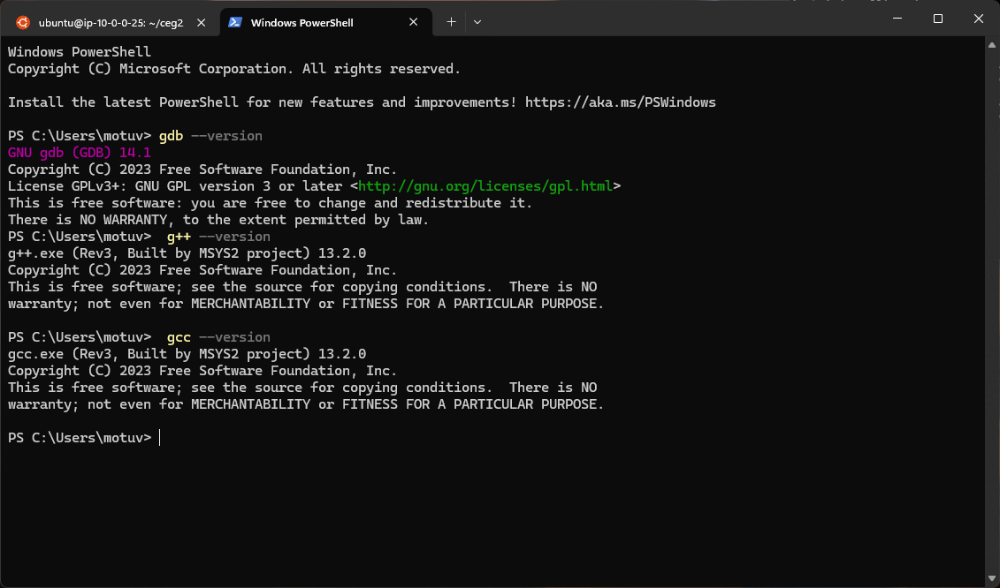
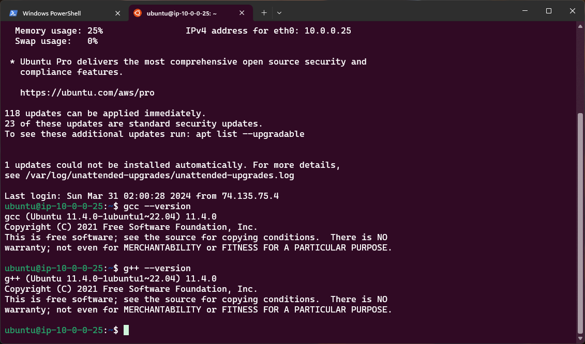
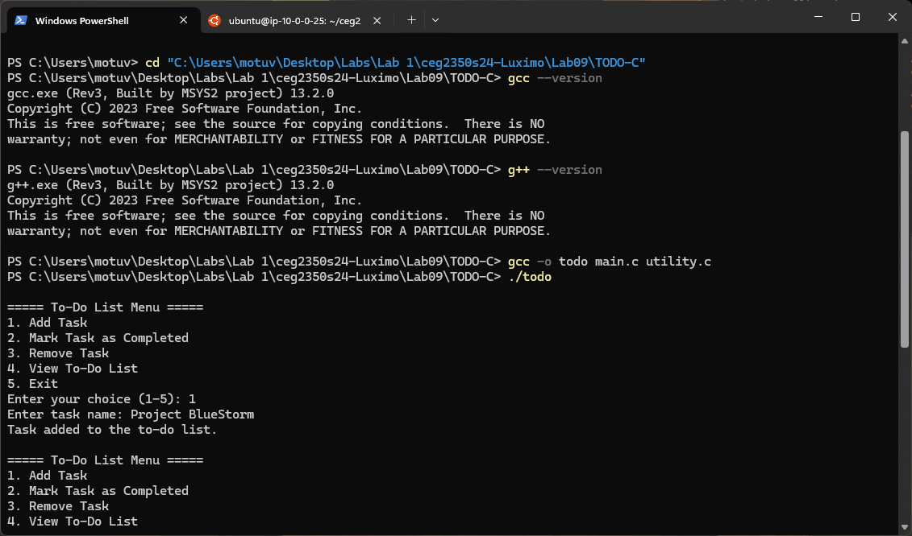
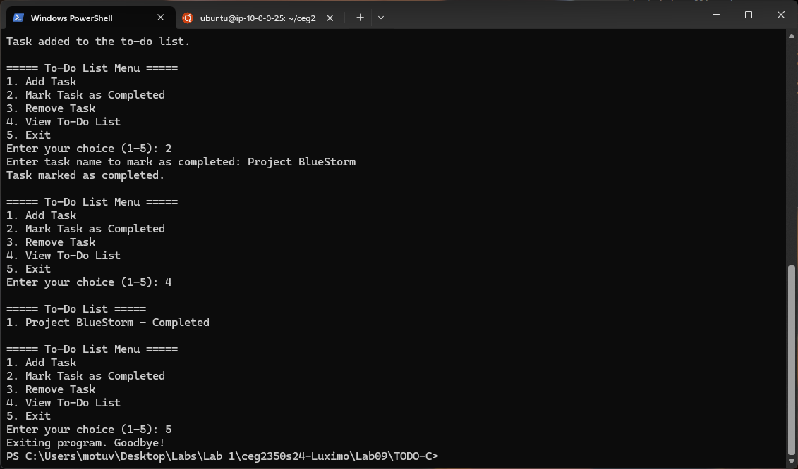
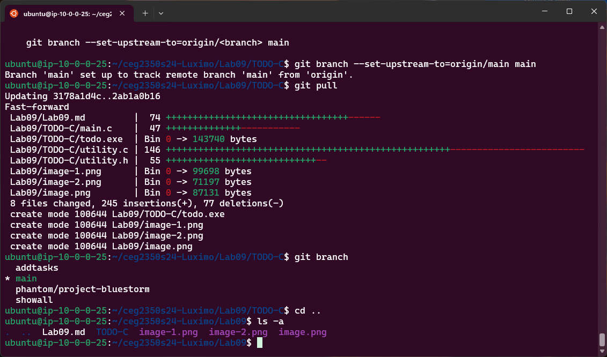

## Lab 09

- Name: Moses Otuvedo
- Email: Otuvedo.3@wright.edu

## Part 1 - Compiling

1. Method & command to get a copy of the source code files:
    -   `git clone --no-checkout https://github.com/pattonsgirl/CEG2350.git`

    -   `cd CEG2350`

    -   `git sparse-checkout init --cone`

    -   `git sparse-checkout set Labs/Lab09/TODO-C`

    -   `git checkout`

    -   `cd ceg2350s25-Luximo/Lab09`

    -   `git add .`

    -   `git commit -m "TODO-C prototype for testing"`

    -   `git push origin main`


2. Windows C / C++ compiler
   - Download Windows installer from: `https://github.com/msys2/msys2-installer/releases/download/2024-01-13/msys2-x86_64-20240113.exe`

   - Confirm installed in Windows: 
    -   ```
        gcc --version
        g++ --version
        gdb --version
        ```
    -   


3. Linux C / C++ compiler
   - Download Linux installer from: `wget https://ftp.gnu.org/gnu/gcc/gcc-13.2.0/gcc-13.2.0.tar.gz`

   -    `tar -xzf gcc-13.2.0.tar.gz`
   -    `cd gcc-13.2.0`
   -    `./contrib/download_prerequisites`
   -    `mkdir build && cd build`
   -    `../configure --enable-languages=c,c++ --disable-multilib`
   -    I encountered an error with running this command to  run the configure script, to fix this, I'd to run the command below:
   -    `sudo apt update`
   -    `sudo apt install g++`
   -    `../configure --enable-languages=c,c++ --disable-multilib`
   -    `make -j$(nproc)`
   -    `sudo make install`
   -    `gcc --version`
   -    `g++ --version`

   - Confirm installed in Linux: 
   ```
    gcc --version
    g++ --version

   ```

   
4. Browser based compiler for C / C++: `https://paiza.io/en/languages/online-c-compiler`
5. Command(s) to compile the source code into an executable program: 
    -   `gcc -o todo main.c utility.c`

6. Command(s) to execute the program:
    -   `./todo`

## Part 2 - Document

### Program User Guide

#### Program Description

The program is a simple command-line To-Do List application. Its purpose is to allow users to manage their tasks by adding new tasks, marking tasks as completed, removing tasks, and viewing the entire list of tasks.


#### How to Build and Run Program
1.  Build the Program: To compile the source code into an executable, use the following command in the terminal:
-   `gcc -o todo main.c utility.c`

    This command will create an executable named `todo`.

2.  Run the Program: To run the compiled program, execute the following command:
-   `./todo`

    This will start the program and display the To-Do List menu.

#### How to Use Program
-   When the program starts, it will display a menu with options:
    1.  Add Task
    2.  Mark Task as Completed
    3.  Remove Task
    4.  View To-Do List
    5.  Exit

-   Enter the number corresponding to your choice and follow the on-screen prompts to manage your To-Do List like this below:




### `git` `branch` Guide

Create a branch: `git branch phantom/project-bluestorm`

Change to branch: `git checkout phantom/project-bluestorm` 

Add branch to remote if created locally (GitHub): `git push -u origin phantom/project-bluestorm`

Steps to `merge` changes to another branch (`main`): 
-   Switch to the branch you want to merge into main:
-   `git checkout main`

-   Merge the changes from the other branch in `phantom/project-bluestorm`:
-   `git merge phantom/project-bluestorm`

-   Since there's no conflict, then run:
-   `git push origin main`

-   I encountered some conflicts here...
    ```
        git fetch origin (Fetch the latest changes from GitHub first, my bad...🥲)

        git merge origin/main

        git push origin main
    ```

Steps to resolve a `merge` conflict: 

-   Identify the files with conflicts which are comments I added to my c files.

-   Open the conflicting files and look for the lines that Git has marked with <<<<<<<, =======, and >>>>>>>.

-   Edit the files to resolve the conflicts. I'd to merge the changes manually.

-   After resolving the conflicts, save the files and mark them as resolved by running this:
-   `git add main.c utility.c utility.h`

-   Commit the Resolved Changes: 
-   `git commit -m "Resolved merge conflicts"` 

-   Push the Resolved Changes:
-   `git push origin phantom/project-bluestorm`

-   On GitHub, I created pull requests for each branch that had the resolved changes

-   After reviewing the pull requests, I merged them into the main branch on GitHub.

-   To ensure my local main branch is up-to-date, I pulled the latest changes:
    ```
        git checkout main
        git pull origin main

    ```

-   Navigate to the TODO-C directory:
-   `cd Lab09/TODO-C`

-   Verify the Current Files:
-   `ls -a`



## Part 3 - makey makey

Using `Makefile` to build executable: `make build`

Using `Makefile` to run program: `make run`

Using `Makefile` to remove compilation files, such as the executable: `make clean`

## Extra Credit - Ignore That

[`.gitignore` file in root of repository](../.gitignore)

