## Lab 10

- Name: Moses Otuvedo
- Email: Otuvedo.3@wright.edu

## Part 1 - Linux Network Command Cheat Sheet

- `hostname`: 
    -   This command reveals the network name of the system. It’s a straightforward way to identify your computer on a network.

- `ifconfig`:
    -   This utility displays the network interfaces’ configurations, detailing IP addresses, netmask, and MTU. It’s essential for network management and troubleshooting.

- `ip addr show`:
    -   It lists all network interfaces, along with their IP addresses and other network settings. This command is quite useful for a detailed network interface overview.

- `route`: 
    -   This command presents the kernel’s IP routing table, showing destinations, gateways, and metrics. It’s vital for understanding how data packets travel across the network.

- `cat /var/lib/dhcp/dhclient.leases`:
    -   If active, this would show the DHCP client’s leases, providing insights into the network’s dynamic configuration.

- `cat /etc/resolv.conf`:
    -   It displays the DNS resolver settings, including nameservers and search domains. This file is crucial for DNS resolution and network connectivity.

- `curl ipinfo.io`:
    -   This fetches a variety of network information about the current IP address, such as location and organisation details. It’s a quick method to gather IP-related data.

- `iptables -L`:
    -   Lists all the current firewall rules set by iptables. It’s a key command for security and firewall configuration review.

- `nmap -p <IP_or_hostname>`: 
    -   Scans for open ports on a specified IP or hostname. It’s widely used in security audits and network assessments.

- `tcpdump -i <networkinterface> -n host <IP_or_hostname>`:
    -   Captures and displays network packets on a specified interface to or from a given IP or hostname. This is an indispensable tool for network analysis and monitoring.

## Part 2 - Network Info

### Network Info for <Windows 11>

1. Hostname of the device: `hostname`
    -   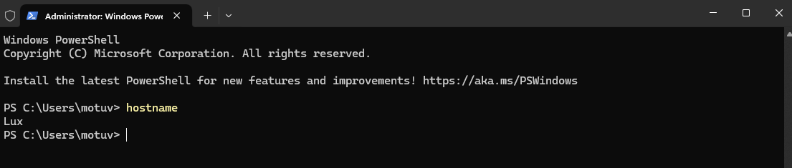

2. MAC address of the NIC connected to the network: `Get-NetIPConfiguration | select -ExpandProperty IPv4Address`
    -   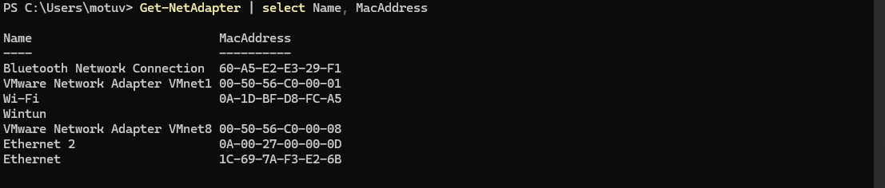

3. IPv4 address: `Get-NetIPConfiguration | select -ExpandProperty IPv4Address | select IPAddress`
    -   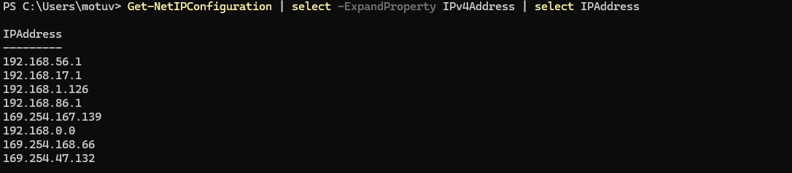

4. Subnet mask: `Get-NetIPConfiguration | select -ExpandProperty IPv4Address | select PrefixLength`
    -   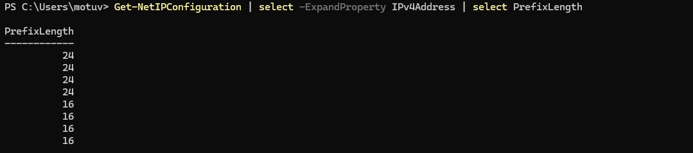

5. Gateway address: `Get-NetIPConfiguration | select -ExpandProperty IPv4Address | select @{Name='DefaultGateway'; Expression={ $_.IPv4DefaultGateway.NextHop }}`
    -   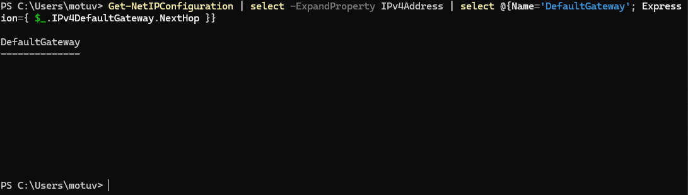

6. DHCP server address: `Get-DhcpServerInDC`
    -   I do not have one to specify...🥲
    -   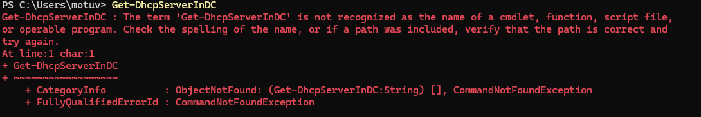

7. DNS server address: `Get-DnsClientServerAddress`
    -   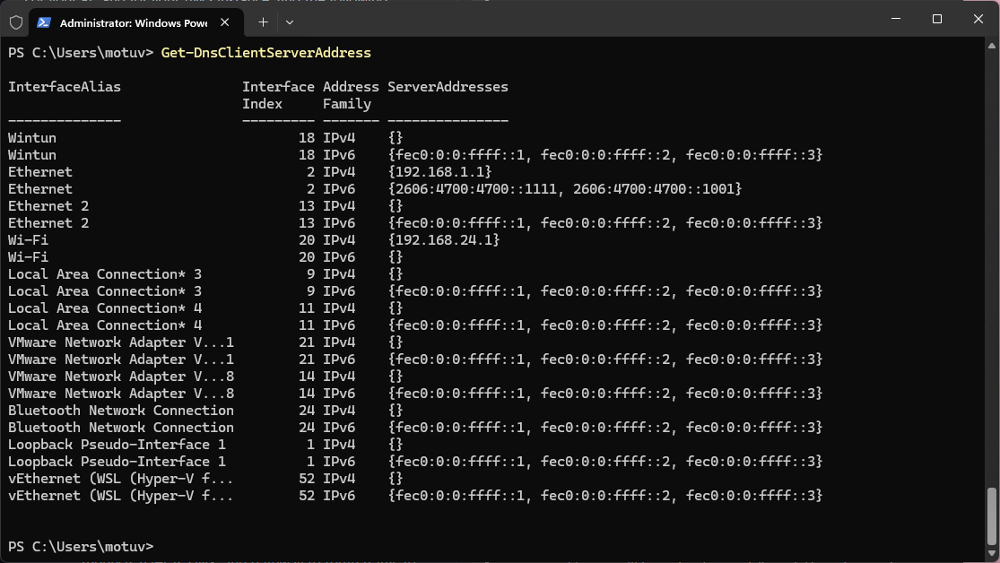

8. Public IPv4 address: `Invoke-RestMethod -Uri http://ipinfo.io/json | Select -ExpandProperty ip`
    -   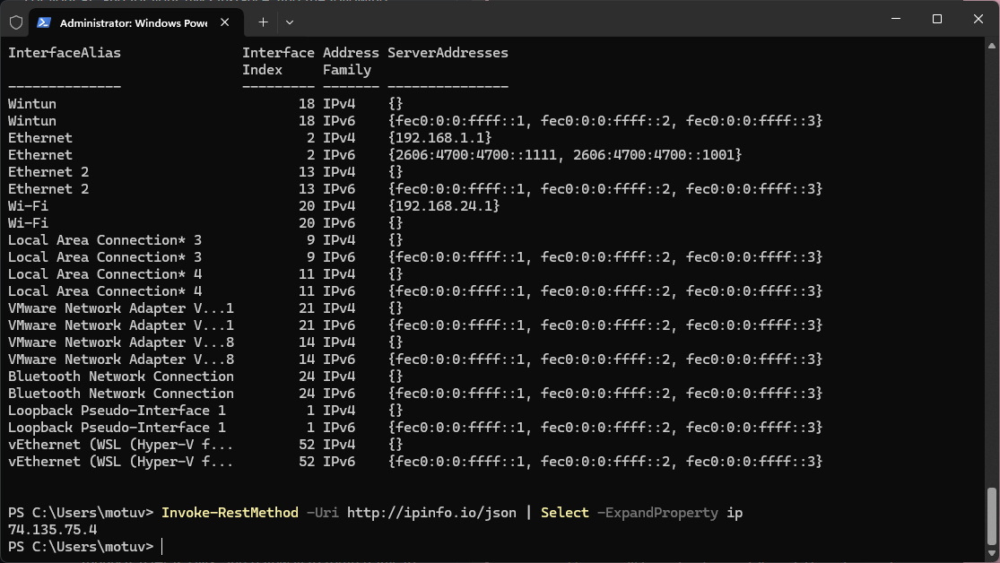

### Network Info for AWS Instance

1. Hostname of the device: `hostname`
    -   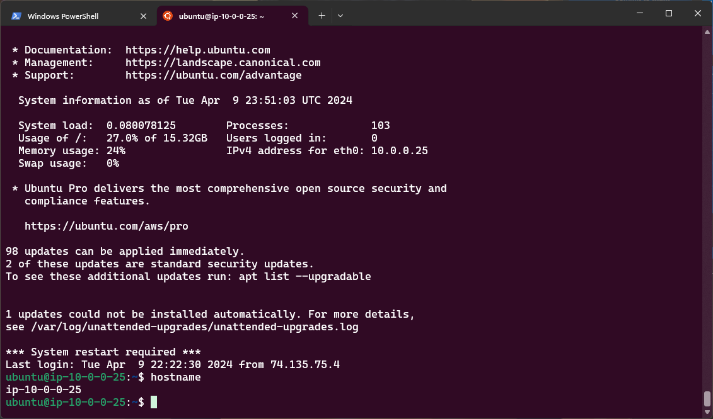

2. MAC address of the NIC connected to the network: `cat /sys/class/net/eth0/address`. 
    -   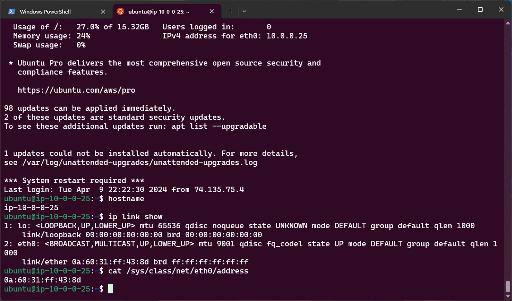
    -   

3. IPv4 address: `ip -4 addr show eth0 | grep -oP '(?<=inet\s)\d+(\.\d+){3}'`
    -   

4. Subnet mask: `ip -4 addr show eth0 | grep -oP '(?<=inet\s)\d+(\.\d+){3}/\d+'`
    -   

5. Gateway address: `ip route show default | grep -oP '(?<=via\s)\d+(\.\d+){3}'`
    -   

6. DHCP server address: `cat /var/lib/dhcp/dhclient.leases`
    -   I do not have one to specify...🥲
    -   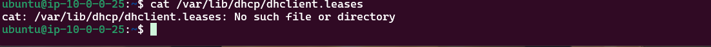

7. DNS server address: `cat /etc/resolv.conf | grep nameserver`
    -   

8. Public IPv4 address: `curl http://ipinfo.io/ip`
    -   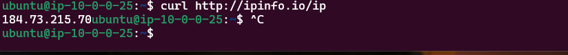

## Part 3 - Subnet Translation

Translate the below CIDR notation subnets to their IP ranges:
1. `130.108.0.0/16`
2. `192.168.1.0/8`
3. `8.8.8.8/32`

| CIDR Notation  | IP Range Start | IP Range End    | Binary Start                        | Binary End                          |
|----------------|----------------|-----------------|--------------|------------------------------------------------------------|
| 130.108.0.0/16 | 130.108.0.0    | 130.108.255.255 | 10000010.01101100.00000000.00000000 | 10000010.01101100.11111111.11111111 |
| 192.168.1.0/8  | 192.0.0.0      | 192.255.255.255 | 11000000.00000000.00000000.00000000 | 11000000.11111111.11111111.11111111 |
| 8.8.8.8/32     | 8.8.8.8        | 8.8.8.8         | 00001000.00001000.00001000.00001000 | 00001000.00001000.00001000.00001000 |

Translate the below IP ranges to their CIDR notation subnets:
1. `192.168.1.0 - 192.168.1.255`
2. `172.16.0.0 - 172.16.255.255`
3. `132.189.13.78 - 132.189.13.78`

| IP Range                      | CIDR Notation    | Binary Start                        | Binary End                          |
|-------------------------------|------------------|-------------------------------------|-------------------------------------|
| 192.168.1.0 - 192.168.1.255   | 192.168.1.0/24   | 11000000.10101000.00000001.00000000 | 11000000.10101000.00000001.11111111 |
| 172.16.0.0 - 172.16.255.255   | 172.16.0.0/16    | 10101100.00010000.00000000.00000000 | 10101100.00010000.11111111.11111111 |
| 132.189.13.78 - 132.189.13.78 | 132.189.13.78/32 | 10000100.10111101.00001101.01001110 | 10000100.10111101.00001101.01001110 |

## Part 4 - Security

Screenshot of your changed Inbound Security Group rules.  

1. Remove the two default rules:
    -   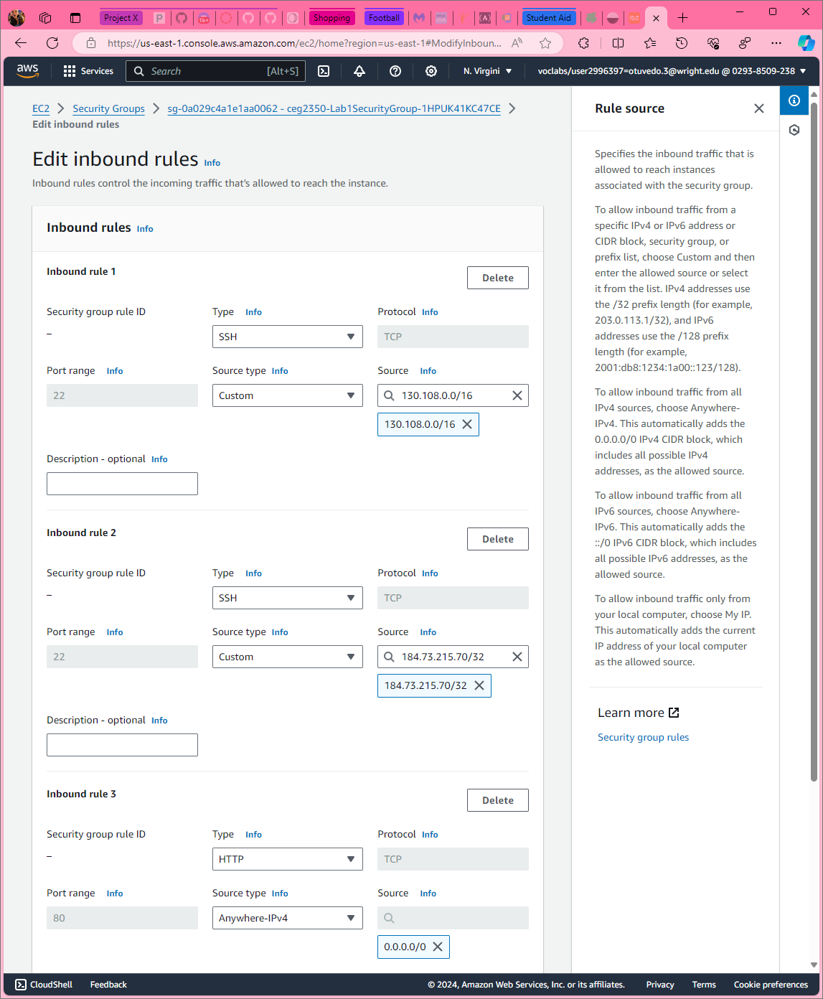
    - After updating the security group rules, I couldn't connect to my instance, so I'd to add back the default rules and try to connect again and it works fine...
    -   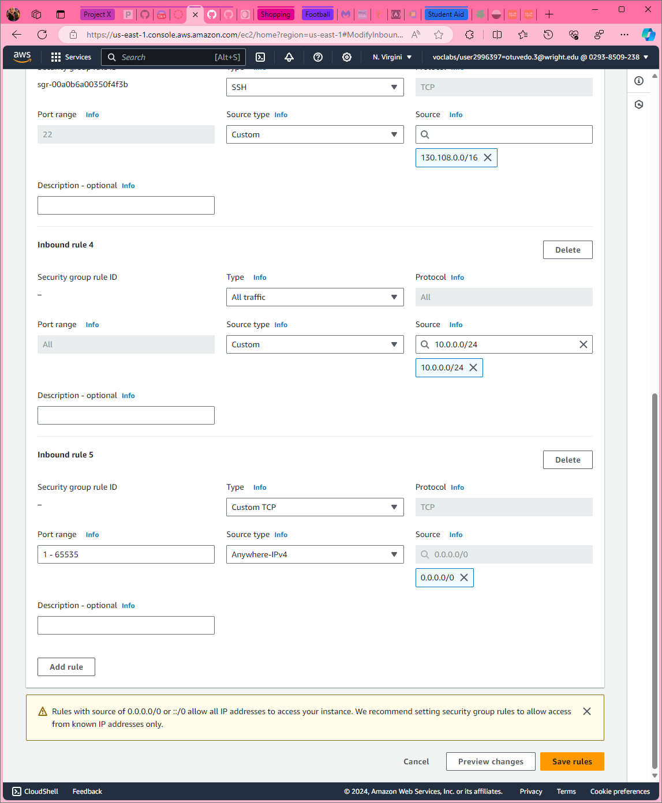
    -   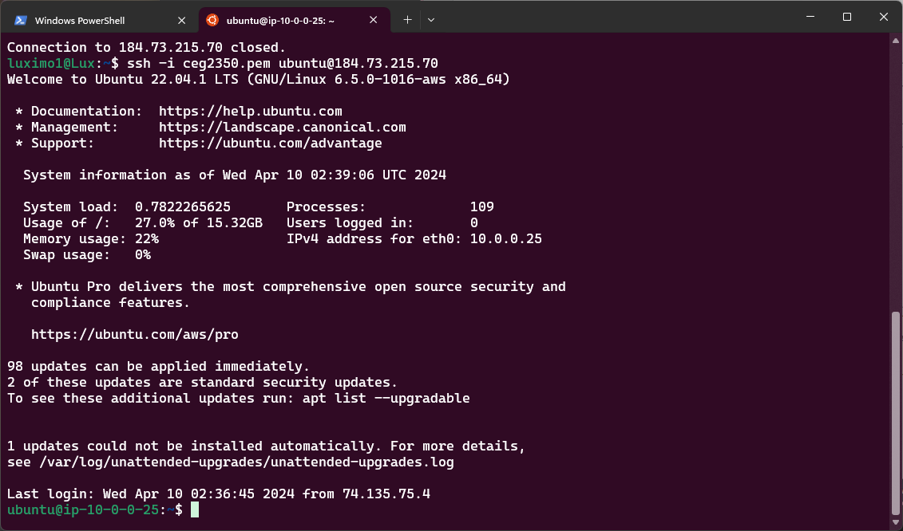

-   Why should HTTP allow any IP, while SSH has restrictions?
    -   `Answer`: HTTP is ubiquitously sanctioned from any IP address, as it constitutes the protocol for web page retrieval, which are customarily intended for public accessibility. In contrast, SSH is employed for secure remote access and system management, thus its usage is confined to specific IP addresses to attenuate the prospect of illicit access and concomitant security vulnerabilities. Upon contemplation of their respective functions, the expansive accessibility of HTTP is warranted by its integral role in the widespread dissemination of information, aligning with the inherent design of web pages for public consumption. Conversely, the employment of SSH is intrinsically linked to the secure administration and remote logins, mandating stringent access restrictions to safeguard sensitive procedures and data. This dichotomy in access levels epitomises the equilibrium sought between the transparency requisite for services interfacing with users and the imperative of security for administrative portals.

## Extra Credit - Tattle Tale

### IPv4 Source Report

| Rank  | IPv4 Address | # of Attempts |
| ----- | ------------ | ------------- |
| 1     |              |     |
| 2     |              |     |
| 3     |              |     |
| 4     |              |     |
| 5     |              |     |

Commands to parse `csv` for report:

### Username Used Report

| Rank  | Username     | # of Attempts |
| ----- | ------------ | ------------- |
| 1     |              |     |
| 2     |              |     |
| 3     |              |     |
| 4     |              |     |
| 5     |              |     |

Commands to parse `csv` for report: